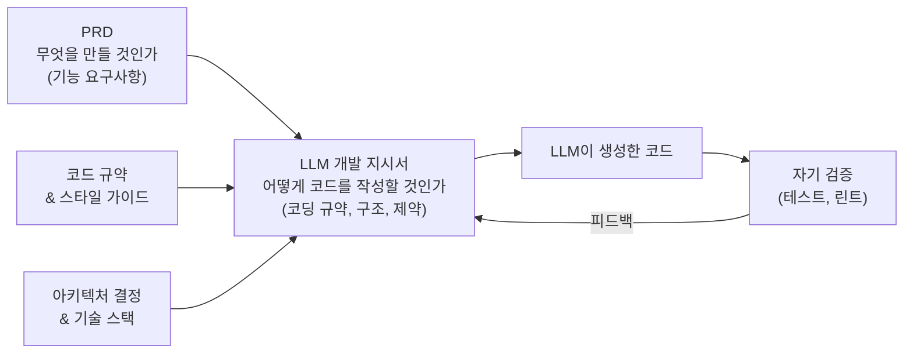
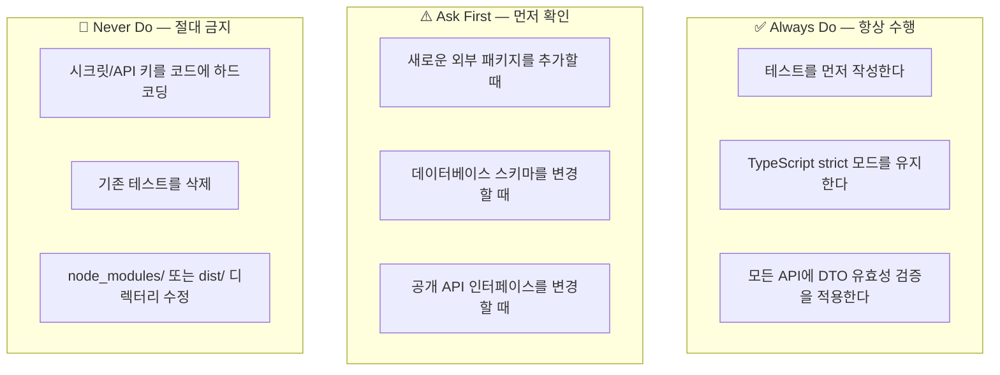
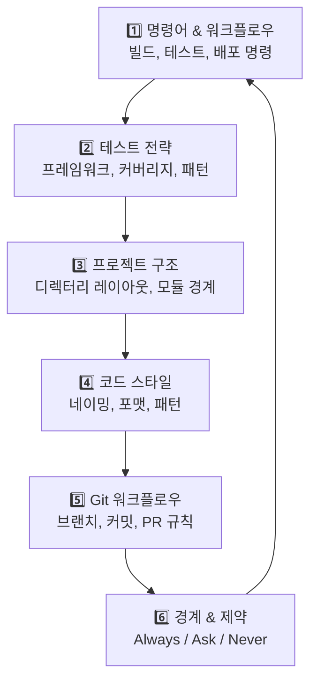
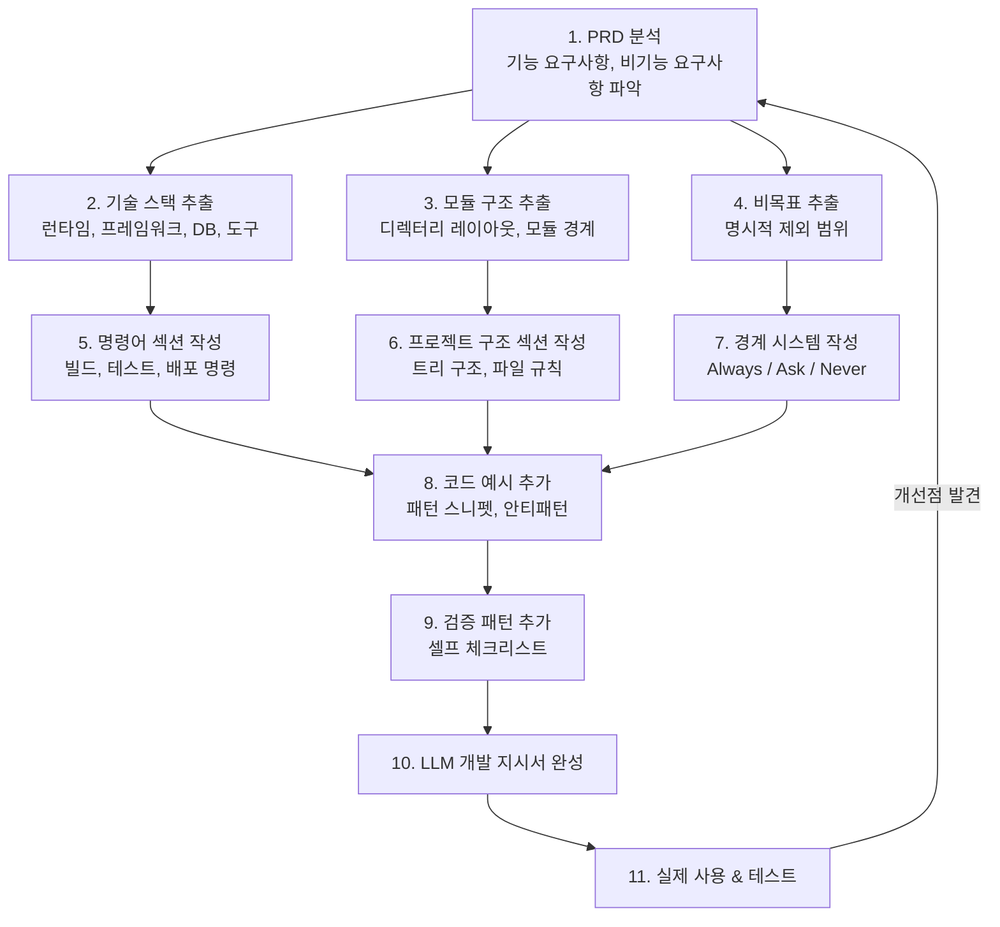

# LLM 개발 지시서 작성 가이드

> **문서 버전**: v1.0
> **작성일**: 2026-02-26
> **작성자**: jhkim
> **상태**: Draft

---

## 변경 이력 (Changelog)

| 버전 | 날짜 | 작성자 | 변경 내용 |
|------|------|--------|----------|
| v1.0 | 2026-02-26 | jhkim | 최초 작성 — 웹 리서치 기반 LLM 개발 지시서 작성법 체계 정리 |

---

## 1. 이 문서의 목적과 대상

### 1.1 목적

이 문서는 **LLM 코딩 어시스턴트에게 개발을 지시하기 위한 "개발 지시서"를 효과적으로 작성하는 방법**을 체계적으로 정리한 실무 가이드이다.

단순한 프롬프트 팁 모음이 아니라, 프로젝트 레벨에서 LLM이 일관되고 정확한 코드를 생성하도록 유도하는 **구조화된 지시 문서**의 설계 원칙, 작성법, 템플릿, 실전 예시를 포함한다.

### 1.2 대상 독자

- LLM 코딩 도구를 사용하여 개발하는 **소프트웨어 엔지니어**
- AI 어시스턴트 활용 표준을 수립하려는 **테크 리드 / 아키텍트**
- LLM 기반 개발 워크플로우를 도입하려는 **프로젝트 매니저**

### 1.3 다루는 LLM 코딩 도구

| 도구 | 지시서 파일 | 주요 특징 |
|------|-----------|----------|
| **Claude Code** | `CLAUDE.md` | 세션 시작 시 자동 로딩, `@imports` 지원 |
| **Cursor** | `.cursor/rules/*.mdc` | 글로브 패턴 기반 자동 적용, MDC 형식 |
| **Windsurf** | `.windsurf/rules/rules.md` | Cascade 에이전트 연동, 프로젝트 레벨 규칙 |
| **GitHub Copilot** | `.github/copilot-instructions.md` | GitHub 생태계 통합, agents.md 지원 |
| **OpenAI Codex** | `AGENTS.md` / System Prompt | CLI 기반 에이전트, 시스템 프롬프트 설정 |
| **Google Gemini** | System Instruction | API 레벨 시스템 지시, Gemini CLI 지원 |

### 1.4 이 문서의 범위

- **포함**: 지시서 설계 원칙, 구조, 템플릿, 도구별 형식, 프롬프트 기법, 실전 예시, 품질 검증
- **제외**: 특정 LLM의 API 사용법, 모델 파인튜닝, RAG 파이프라인 구축

---

## 2. LLM 개발 지시서란?

### 2.1 정의와 범위

**LLM 개발 지시서**는 LLM 코딩 어시스턴트에게 프로젝트의 기술 컨텍스트, 코딩 규약, 아키텍처 결정, 제약 조건을 전달하는 **구조화된 마크다운 문서**이다.

개발자가 매 대화마다 반복 설명해야 하는 내용을 사전에 정의하여, LLM이 세션 시작과 동시에 프로젝트 컨텍스트를 파악하도록 한다.

**유사 개념과의 구분:**

| 개념 | 대상 | 수명 | 예시 |
|------|------|------|------|
| **일회성 프롬프트** | 단일 작업 | 1회 대화 | "이 함수에 에러 핸들링 추가해줘" |
| **시스템 프롬프트** | LLM의 전역 행동 | API 세션 | "You are a senior TypeScript developer" |
| **LLM 개발 지시서** | 프로젝트 전체 | 프로젝트 수명 | CLAUDE.md, .cursorrules, AGENTS.md |
| **PRD** | 제품 요구사항 | 릴리스 사이클 | app-PRD-v0.1.md |

### 2.2 왜 필요한가?

**LLM은 생략에서 추론하지 못한다.** 전통적 개발에서 경험 많은 개발자는 암묵적 규약을 따르지만, LLM은 명시되지 않은 것을 임의로 결정한다.

| 명시하지 않으면... | LLM이 할 수 있는 일 |
|-------------------|-------------------|
| 코드 스타일 미지정 | CommonJS와 ES Modules을 혼용 |
| 테스트 프레임워크 미지정 | Mocha, Jest, Vitest를 무작위 선택 |
| 금지 사항 미지정 | 시크릿을 하드코딩하거나 프로덕션 DB에 직접 접근 |
| 디렉터리 구조 미지정 | 파일을 프로젝트 루트에 무분별하게 생성 |
| 비목표 미지정 | 요청하지 않은 기능(인증, 캐싱 등)을 자체 추가 |

> **Stack Overflow Developer Survey 2025**: 개발자의 84%가 AI 도구를 사용하거나 사용할 계획이며, 51%가 매일 사용한다. 그러나 명시적 지시 없이 사용하면 생성된 코드의 재작업률이 크게 증가한다.

### 2.3 PRD와 LLM 개발 지시서의 관계

PRD는 **무엇을 만들 것인가**(WHAT)를 정의하고, LLM 개발 지시서는 **LLM이 어떤 방식으로 코드를 작성해야 하는가**(HOW-TO-CODE)를 정의한다. 이 둘은 상호 보완 관계이다.



---

## 3. 핵심 원칙 6가지

### 3.1 명시적 선언 원칙 (Explicit Over Implicit)

**LLM에게 전달하지 않은 것은 존재하지 않는 것이다.** 모든 규약, 제약, 선호를 명시적으로 선언해야 한다.

| 암묵적 (나쁜 예) | 명시적 (좋은 예) |
|-----------------|-----------------|
| "깔끔한 코드를 작성해" | "ESLint airbnb 규칙을 따르고, 함수는 50줄 이하로 유지해" |
| "적절한 에러 핸들링" | "모든 API 핸들러에서 try-catch로 감싸고, AppException 클래스를 throw해" |
| (언급 없음) | "Non-Goal: 외부 라이브러리(lodash 등) 신규 추가 금지" |

**비목표(Non-Goals)의 중요성**: 전통적 PRD에서는 범위를 암묵적으로 제한할 수 있지만, LLM은 언급되지 않은 기능을 자발적으로 추가할 수 있다. **명시적으로 "하지 말아야 할 것"을 선언**해야 범위를 통제할 수 있다.

### 3.2 구조화된 사고 유도 (Structured Chain-of-Thought)

LLM이 코드를 바로 생성하기 전에 **단계별로 사고하도록 유도**하면 정확도가 크게 향상된다.

**기본 CoT (Chain-of-Thought)**:
```
구현 전에 다음 단계를 따라 계획을 세워라:
1. 영향받는 파일과 모듈을 식별한다
2. 기존 코드와의 의존성을 분석한다
3. 변경 계획을 작성한다
4. 계획이 승인되면 구현한다
```

**구조화된 CoT (SCoT — Structured Chain-of-Thought)**:

학술 연구에 따르면, LLM에게 **순차(sequential), 분기(branch), 반복(loop)** 세 가지 프로그래밍 구조로 추론 단계를 작성하게 하면 일반 CoT 대비 **정확도 15.27% 향상, 코드 스멜 36.08% 감소** 효과가 있다.

```
다음 구조로 구현 계획을 작성해라:
- [순차] 먼저 Prisma 스키마를 업데이트한다 → 마이그레이션을 생성한다 → 시드 데이터를 추가한다
- [분기] 커넥터 타입이 'file'이면 FileDriver를 사용하고, 'postgresql'이면 PgDriver를 사용한다
- [반복] 각 메타데이터 필드에 대해 유효성 검증 규칙을 적용한다
```

### 3.3 모듈화 원칙 (Avoid the "Curse of Instructions")

**지시가 너무 많으면 성능이 저하된다.** 모든 규칙을 하나의 파일에 넣으면 LLM의 주의력이 분산되어 중요한 지시를 놓칠 수 있다.

**해결 전략:**

- **관심사 분리**: 아키텍처, 테스트, 코드 스타일, 보안 등 주제별로 파일을 분리한다
- **관련 정보만 제공**: 현재 작업에 필요한 지시 섹션만 참조한다
- **계층적 요약**: 메인 지시서에는 핵심 규칙만, 상세 규칙은 별도 파일에 작성한다

```
.claude/
├── CLAUDE.md                    # 핵심 규칙 (300줄 이하)
└── rules/
    ├── architecture.md          # 아키텍처 규칙
    ├── testing.md               # 테스트 전략
    ├── api-conventions.md       # API 컨벤션
    └── security.md              # 보안 규칙
```

### 3.4 코드 예시 우선 (Show, Don't Tell)

**GitHub의 2,500+ agents.md 분석** 결과, 가장 효과적인 지시서는 산문 설명보다 **실제 코드 예시**를 사용한다. 한 개의 코드 스니펫이 세 단락의 설명보다 정확한 코드를 생성하게 한다.

**나쁜 예 (산문만 사용):**
```
서비스 클래스는 NestJS의 Injectable 데코레이터를 사용하고,
생성자에서 리포지토리를 주입받아야 합니다.
메서드 이름은 camelCase를 사용하고...
```

**좋은 예 (코드 예시 제공):**
```typescript
// ✅ 서비스 클래스 작성 규약
@Injectable()
export class MetadataService {
  constructor(
    private readonly prisma: PrismaService,
    private readonly eventEmitter: EventEmitter2,
  ) {}

  async findById(id: string): Promise<MetadataResponseDto> {
    const metadata = await this.prisma.metadata.findUniqueOrThrow({
      where: { id },
    });
    return MetadataResponseDto.from(metadata);
  }
}
```

### 3.5 자기 검증 패턴 (Self-Verification)

지시서에 **검증 단계를 내장**하여 LLM이 코드 생성 후 스스로 품질을 확인하도록 유도한다.

```markdown
## 검증 규칙
코드 생성 후 반드시 다음을 확인해라:
- [ ] 새로운 API 엔드포인트에 대한 단위 테스트가 작성되었는가
- [ ] DTO에 class-validator 데코레이터가 적용되었는가
- [ ] 에러 응답이 표준 에러 포맷(AppException)을 따르는가
- [ ] import 경로에 순환 참조가 없는가
```

### 3.6 3단계 경계 시스템 (Three-Tier Boundary System)

단순한 "하지 마" 목록 대신, **3단계로 분류된 경계 시스템**을 사용하여 LLM에게 명확한 의사결정 프레임워크를 제공한다.



| 단계 | 의미 | 예시 |
|------|------|------|
| ✅ **Always** | 승인 없이 항상 수행 | 테스트 작성, 린트 규칙 준수, 타입 안전성 유지 |
| ⚠️ **Ask First** | 고영향 작업, 사람의 확인 필요 | 패키지 추가, 스키마 변경, API 인터페이스 변경 |
| 🚫 **Never** | 어떤 상황에서도 수행 금지 | 시크릿 커밋, 프로덕션 DB 직접 접근, 기존 테스트 삭제 |

---

## 4. LLM 도구별 지시서 형식 비교

### 4.1 Claude Code — CLAUDE.md

**파일 위치 계층 (우선순위 순):**

1. `프로젝트루트/CLAUDE.md` — 팀 공유, 버전 관리 (가장 일반적)
2. `프로젝트루트/.claude/CLAUDE.md` — 정리된 하위 디렉터리
3. `~/.claude/CLAUDE.md` — 사용자 레벨 전역 기본값
4. `프로젝트루트/CLAUDE.local.md` — 개인 설정, `.gitignore`에 추가

**핵심 기능:**

- **자동 로딩**: 세션 시작 시 자동으로 읽어 컨텍스트에 포함
- **@imports**: `@docs/api-conventions.md` 형태로 외부 파일 참조 가능
- **모듈러 규칙**: `.claude/rules/` 디렉터리 내 모든 `.md` 파일 자동 로딩
- **권장 길이**: 300줄 이하 (핵심만, 상세는 별도 파일)

**기본 구조 예시:**
```markdown
# ProjectName

프로젝트 한 줄 설명

## Tech Stack
- Backend: NestJS + Fastify v5
- Frontend: Nuxt 3 + Vue 3
- Database: PostgreSQL 18, Prisma ORM
- Cache: Redis 7

## Commands
- `npm run dev` — 개발 서버 (포트 3000)
- `npm run test` — Jest 단위 테스트
- `npm run test:e2e` — Playwright E2E 테스트
- `npm run lint` — ESLint 검사
- `npx prisma migrate dev` — DB 마이그레이션

## Code Style
- TypeScript strict 모드, `any` 타입 금지
- Named exports만 사용
- 파일명: kebab-case (예: `metadata-service.ts`)

## Boundaries
- ✅ Always: 테스트 작성, DTO 유효성 검증
- ⚠️ Ask First: 패키지 추가, 스키마 변경
- 🚫 Never: .env 커밋, node_modules 수정
```

### 4.2 Cursor — .cursor/rules/

**파일 위치:** `프로젝트루트/.cursor/rules/` 디렉터리

**핵심 기능:**

- **MDC 형식** (Markdown Components): `.mdc` 확장자 사용
- **글로브 패턴 매칭**: 파일 경로 패턴으로 규칙 자동 적용
- **프로젝트/전역 구분**: 프로젝트 레벨과 전역 레벨 규칙 분리

**MDC 파일 구조:**
```markdown
---
description: NestJS API 모듈 작성 규칙
globs: ["apps/api/src/**/*.ts"]
---

# API Module Rules

- 모든 컨트롤러는 `@ApiTags()` 데코레이터를 포함해야 한다
- 서비스 메서드는 Prisma 트랜잭션 내에서 실행해야 한다
- DTO 클래스는 `class-validator` 데코레이터를 사용해야 한다
```

### 4.3 Windsurf — .windsurf/rules/

**파일 위치:** `프로젝트루트/.windsurf/rules/rules.md`

**핵심 기능:**

- **Cascade 에이전트 연동**: Windsurf의 AI 에이전트에 규칙 전달
- **프로젝트 레벨 오버라이드**: 전역 규칙보다 프로젝트 규칙이 우선

### 4.4 GitHub Copilot — copilot-instructions.md / AGENTS.md

**파일 위치:**

- `.github/copilot-instructions.md` — 리포지토리 레벨 지시
- `AGENTS.md` — 에이전트 모드 전용 지시 (루트 또는 하위 디렉터리)

**AGENTS.md 특징:**

- **개방형 표준**: 도구에 종속되지 않는 범용 에이전트 지시 형식
- **디렉터리 계층**: 하위 디렉터리에 별도 `AGENTS.md` 배치 가능, 가장 가까운 파일이 우선
- **GitHub 생태계 통합**: PR, 이슈, 코드 리뷰와 연동

### 4.5 OpenAI Codex

- **시스템 프롬프트** 또는 **AGENTS.md** 기반으로 지시 전달
- CLI 환경에서 실행, stdin/stdout 인터페이스
- 샌드박스 환경에서 코드 실행 및 검증

### 4.6 Google Gemini

- **System Instruction**으로 API 레벨에서 지시 전달
- Gemini CLI를 통한 프로젝트 레벨 설정
- `GEMINI.md` 파일 지원 (실험적)

### 4.7 비교 매트릭스

| 특성 | Claude | Cursor | Windsurf | Copilot | Codex | Gemini |
|------|--------|--------|----------|---------|-------|--------|
| **지시서 파일** | CLAUDE.md | .cursor/rules/*.mdc | .windsurf/rules/ | .github/copilot-instructions.md | AGENTS.md | System Instruction |
| **자동 로딩** | ✅ | ✅ (글로브 매칭) | ✅ | ✅ | ✅ | API 설정 |
| **모듈화** | .claude/rules/ | 다중 .mdc 파일 | 다중 규칙 파일 | AGENTS.md 계층 | 단일 파일 | 단일 지시 |
| **@imports** | ✅ | ❌ | ❌ | ❌ | ❌ | ❌ |
| **글로브 패턴** | ❌ | ✅ | ❌ | ❌ | ❌ | ❌ |
| **권장 길이** | 300줄 이하 | 파일당 200줄 이하 | 제한 없음 | 제한 없음 | 간결 권장 | 토큰 제한 내 |
| **버전 관리** | Git 권장 | Git 권장 | Git 권장 | Git 통합 | Git 권장 | 별도 관리 |

---

## 5. 지시서의 6대 핵심 영역

GitHub의 2,500+ 에이전트 설정 파일 분석 결과, 효과적인 지시서는 다음 **6개 핵심 영역**을 다룬다.



### 5.1 명령어 & 워크플로우 (Commands & Workflow)

LLM이 코드를 빌드하고 테스트하고 검증할 수 있도록 **정확한 명령어**를 제공해야 한다. 명령어가 불완전하면 LLM이 잘못된 도구를 사용하거나 실행에 실패한다.

**작성 규칙:**
- 전체 명령어를 플래그와 옵션까지 포함하여 기재
- 명령어의 출력 결과와 기대 동작을 명시
- 환경별 차이(개발/테스트/프로덕션)를 구분

**예시:**
```markdown
## Commands

### 개발
- `npm run dev` — Fastify 개발 서버 (포트 3000, HMR 활성)
- `npm run dev:web` — Nuxt 프론트엔드 개발 서버 (포트 3001)

### 테스트
- `npm run test` — Jest 단위 테스트 (coverage/ 디렉터리에 리포트 생성)
- `npm run test:e2e` — Playwright E2E 테스트
- `npm run test -- --watch` — 파일 변경 감지 모드

### 데이터베이스
- `npx prisma migrate dev --name <migration-name>` — 마이그레이션 생성 및 적용
- `npx prisma generate` — Prisma Client 재생성
- `npx prisma db seed` — 시드 데이터 삽입

### 코드 품질
- `npm run lint` — ESLint 검사
- `npm run lint:fix` — ESLint 자동 수정
- `npm run format` — Prettier 포맷팅
```

### 5.2 테스트 전략 (Testing Strategy)

테스트에 대한 명시적 지시가 없으면, LLM은 테스트를 건너뛰거나 부적절한 프레임워크를 사용한다.

**작성 규칙:**
- 테스트 프레임워크와 라이브러리를 명시
- 테스트 파일의 위치와 네이밍 규칙을 지정
- 최소 커버리지 기준을 설정
- 모킹 전략을 명확히 정의

**예시:**
```markdown
## Testing Strategy

### 프레임워크
- 단위 테스트: Jest + @nestjs/testing
- E2E 테스트: Playwright
- API 테스트: Supertest

### 파일 규칙
- 단위 테스트: `*.spec.ts` (소스 파일과 동일 디렉터리)
- E2E 테스트: `test/e2e/*.e2e-spec.ts`
- 테스트 헬퍼: `test/helpers/`

### 커버리지
- 최소 라인 커버리지: 80%
- 새로운 모듈은 반드시 테스트 포함

### 모킹 전략
- 외부 API 호출: MSW (Mock Service Worker) 사용
- 데이터베이스: Prisma Client를 jest.mock으로 모킹
- Redis: ioredis-mock 사용
- 절대 실제 프로덕션 서비스에 연결하지 않는다
```

### 5.3 프로젝트 구조 (Project Structure)

LLM이 파일을 올바른 위치에 생성하도록 **디렉터리 레이아웃**을 명확히 전달해야 한다.

**작성 규칙:**
- 트리 구조로 디렉터리를 시각화
- 각 디렉터리의 역할과 포함할 파일 유형을 설명
- 새로운 모듈을 추가할 때의 규칙을 명시

**예시:**
```markdown
## Project Structure

### 백엔드 (apps/api/)

apps/api/src/
├── common/                     # 공통 유틸, 에러, 타입, 설정
│   ├── exceptions/             # AppException, 에러 필터
│   ├── guards/                 # AuthGuard, RolesGuard
│   ├── interceptors/           # 로깅, 변환 인터셉터
│   └── pipes/                  # 유효성 검증 파이프
├── auth/                       # 인증/인가 모듈
│   ├── auth.module.ts
│   ├── auth.controller.ts
│   ├── auth.service.ts
│   ├── auth.service.spec.ts    # 단위 테스트
│   ├── dto/                    # 요청/응답 DTO
│   └── strategies/             # JWT, OAuth 전략
├── [module-name]/              # 각 도메인 모듈
│   ├── [module].module.ts
│   ├── [module].controller.ts
│   ├── [module].service.ts
│   ├── [module].service.spec.ts
│   └── dto/
└── app.module.ts               # 루트 모듈
```

### 새 모듈 추가 규칙
- NestJS CLI 패턴을 따른다: `module.ts`, `controller.ts`, `service.ts`
- DTO는 반드시 `dto/` 하위 디렉터리에 위치한다
- 각 모듈은 자체 `*.spec.ts` 테스트 파일을 포함한다


### 5.4 코드 스타일 & 규약 (Code Style & Conventions)

산문 설명보다 **코드 예시**를 사용하여 스타일을 전달한다.

**작성 규칙:**
- 네이밍 규칙을 유형별로 정의 (변수, 함수, 클래스, 파일, 디렉터리)
- 임포트 순서와 그룹핑을 명시
- 에러 핸들링 패턴을 코드로 제시
- 안티패턴을 명시적으로 금지

**예시:**
````markdown
## Code Style

### 네이밍 규칙
| 대상 | 규칙 | 예시 |
|------|------|------|
| 파일 | kebab-case | `metadata-service.ts` |
| 클래스 | PascalCase | `MetadataService` |
| 함수/메서드 | camelCase | `findById()` |
| 상수 | UPPER_SNAKE_CASE | `MAX_RETRY_COUNT` |
| DTO | PascalCase + 접미사 | `CreateMetadataDto` |
| 인터페이스 | PascalCase (I 접두사 금지) | `MetadataRepository` |

### 임포트 순서
```typescript
// 1. Node.js 내장 모듈
import { join } from 'node:path';

// 2. 외부 패키지
import { Injectable } from '@nestjs/common';
import { PrismaService } from '@prisma/client';

// 3. 내부 모듈 (절대 경로)
import { AppException } from '@/common/exceptions';

// 4. 상대 경로 (같은 모듈)
import { CreateMetadataDto } from './dto/create-metadata.dto';
```

### 에러 핸들링 패턴
```typescript
// ✅ Good: AppException 사용
throw new AppException('METADATA_NOT_FOUND', `Metadata ${id} not found`);

// ❌ Bad: 일반 Error 사용
throw new Error('Not found');

// ❌ Bad: HTTP 예외 직접 사용 (서비스 레이어에서)
throw new NotFoundException();  // 컨트롤러에서만 허용
```
````

### 5.5 Git 워크플로우 (Git Workflow)

LLM이 커밋, 브랜치, PR을 생성할 때 팀의 규약을 따르도록 지시한다.

**예시:**
````markdown
## Git Workflow

### 브랜치 네이밍
- feature/[이슈번호]-[설명] — `feature/42-add-metadata-search`
- fix/[이슈번호]-[설명] — `fix/57-connector-timeout`
- chore/[설명] — `chore/update-dependencies`

### 커밋 메시지 (Conventional Commits)

```
<type>(<scope>): <description>

[optional body]

[optional footer]
```

| type | 용도 |
|------|------|
| feat | 새로운 기능 |
| fix | 버그 수정 |
| refactor | 리팩터링 (기능 변경 없음) |
| test | 테스트 추가/수정 |
| docs | 문서 변경 |
| chore | 빌드, 설정, 의존성 변경 |

### 예시
```
feat(metadata): add bulk import endpoint

- POST /api/v1/metadata/bulk-import
- Accepts CSV and JSON formats
- Validates against workspace schema

Closes #42
```
````

### 5.5.1 릴리스 노트 작성 (Release Notes)

작업 배치(Batch) 또는 의미 있는 구현 단위가 완료될 때마다, `docs/releases/` 하위에 릴리스 노트를 작성하여 변경 이력을 기록한다.

**파일 규칙:**
- 경로: `docs/releases/`
- 파일명: `{YYYY-MM-DD}-{프로젝트명}-v{버전}.md`
  - 예: `2026-03-04-metadata-platform-v0.1.0.md`
- 메타 정보는 반드시 **YAML frontmatter**로 기입한다

**YAML frontmatter 예시:**
```yaml
---
title: 프로젝트명 vX.Y.Z — 릴리스 제목
version: X.Y.Z
date: YYYY-MM-DD
branch: feature/branch-name
scope: Task N ~ Task M (구현 계획 기준)
design_doc: docs/plans/YYYY-MM-DD-plan-name.md
---
```

**릴리스 노트 포함 내용:**
- 개요 (변경 요약)
- 기술 스택 (해당 시점의 스택)
- 구현 내역 (Task별 상세)
- 구현 중 발견된 이슈 및 해결
- 남은 작업
- 프로젝트 구조 (현재 시점)

> **Note:** 모든 마크다운 문서의 메타 정보(날짜, 버전, 브랜치 등)는 YAML frontmatter를 사용한다. 본문에 볼드 텍스트로 메타 정보를 기입하지 않는다.

### 5.6 경계 & 제약 (Boundaries & Constraints)

섹션 3.6의 3단계 경계 시스템을 구체적으로 적용한다.

**예시:**
```markdown
## Boundaries

### ✅ Always
- 새로운 API 엔드포인트마다 단위 테스트를 작성한다
- DTO에 `class-validator` 데코레이터를 적용한다
- 모든 비동기 작업에 적절한 에러 핸들링을 포함한다
- 환경 변수는 `@nestjs/config`의 ConfigService를 통해 접근한다

### ⚠️ Ask First
- `package.json`에 새로운 의존성을 추가할 때
- Prisma 스키마(`schema.prisma`)를 변경할 때
- 기존 API 엔드포인트의 요청/응답 형식을 변경할 때
- 새로운 NestJS 모듈을 생성할 때

### 🚫 Never
- `.env` 또는 시크릿 파일을 Git에 커밋하지 않는다
- `node_modules/`, `dist/`, `coverage/` 디렉터리를 수정하지 않는다
- 프로덕션 데이터베이스에 직접 쿼리를 실행하지 않는다
- 기존 테스트를 삭제하거나 `skip`하지 않는다
- `// @ts-ignore` 또는 `as any`를 사용하지 않는다
```

---

## 6. 프롬프트 엔지니어링 기법

### 6.1 역할 정의 (Role Definition / Persona)

LLM에게 **전문가 역할**을 부여하면 해당 도메인에 특화된 답변을 생성한다.

**기본 형식:**
```markdown
당신은 다음 기술 스택에 정통한 시니어 백엔드 엔지니어이다:
- NestJS + Fastify를 사용한 REST API 설계
- Prisma ORM을 사용한 PostgreSQL 데이터 모델링
- Redis + BullMQ를 사용한 비동기 작업 처리
- JWT/OAuth 기반 인증 및 RBAC 구현

다음 원칙을 항상 따른다:
- SOLID 원칙, 특히 단일 책임 원칙(SRP)
- 도메인 주도 설계(DDD)의 핵심 개념
- 12-Factor App 방법론
```

**효과적인 역할 정의의 요소:**

| 요소 | 설명 | 예시 |
|------|------|------|
| 전문 분야 | 기술 스택과 도메인 | "NestJS 시니어 백엔드 엔지니어" |
| 스킬 목록 | 구체적 기술 역량 | "Prisma ORM, BullMQ, JWT" |
| 원칙 | 따라야 할 설계 원칙 | "SOLID, DDD, 12-Factor" |
| 제약 | 행동 제한 | "외부 라이브러리 추가 전 확인" |

### 6.2 Chain-of-Thought (CoT) 기법

#### 기본 CoT

"단계별로 생각해라"라는 단순한 지시만으로도 추론 정확도가 향상된다.

```markdown
## 코드 작성 프로세스
새로운 기능을 구현할 때, 다음 단계를 순서대로 따라라:

1. **분석**: 요구사항을 분석하고 영향받는 모듈을 식별한다
2. **설계**: 데이터 모델, API 인터페이스, 서비스 로직을 설계한다
3. **테스트 작성**: 구현 전에 테스트 케이스를 먼저 작성한다
4. **구현**: 설계에 따라 코드를 작성한다
5. **검증**: 테스트를 실행하고 린트를 확인한다
```

#### 구조화된 CoT (SCoT)

순차/분기/반복 구조를 명시적으로 사용하여 코드 생성 정확도를 높인다.

```markdown
## 커넥터 모듈 구현 가이드

### 순차 (Sequential)
1. `ConnectorModule`을 생성한다
2. `ConnectorService`에서 드라이버를 초기화한다
3. `ConnectorController`에서 REST 엔드포인트를 노출한다

### 분기 (Branch)
- 커넥터 타입이 `file`이면:
  → `FileConnectorDriver`를 사용하여 로컬 파일을 읽는다
  → 지원 형식: CSV, JSON, JPEG, PNG, PDF, MP4, MOV
- 커넥터 타입이 `postgresql`이면:
  → `PostgresConnectorDriver`를 사용하여 DB 메타데이터를 추출한다
  → connection string을 ConfigService에서 가져온다
- 커넥터 타입이 `openapi`이면:
  → `OpenApiConnectorDriver`를 사용하여 스펙을 파싱한다

### 반복 (Loop)
- 추출된 각 테이블에 대해:
  → 컬럼 메타데이터를 추출한다
  → 데이터 타입을 app 표준 타입으로 매핑한다
  → 메타데이터 레코드를 생성한다
```

### 6.3 Few-Shot 예시 기법

LLM에게 **입력-출력 쌍**을 제시하면, 패턴을 학습하여 일관된 결과를 생성한다.

**효과적인 Few-Shot의 규칙:**
1. **2~5개** 예시가 적정 (너무 많으면 컨텍스트 소모)
2. **다양한 케이스**를 포함 (정상, 엣지, 에러)
3. **동일한 구조**를 유지 (입력 형식, 출력 형식 일관)

## API 엔드포인트 작성 패턴

### 예시 1: 단건 조회
입력: "워크스페이스를 ID로 조회하는 API"
출력:
```typescript
@Get(':id')
@ApiOperation({ summary: '워크스페이스 조회' })
@ApiOkResponse({ type: WorkspaceResponseDto })
async findOne(@Param('id', ParseUUIDPipe) id: string): Promise<WorkspaceResponseDto> {
  return this.workspaceService.findById(id);
}
```

### 예시 2: 목록 조회 (페이지네이션)
입력: "워크스페이스 목록을 페이지네이션으로 조회하는 API"
출력:
```typescript
@Get()
@ApiOperation({ summary: '워크스페이스 목록 조회' })
@ApiOkResponse({ type: PaginatedResponseDto<WorkspaceResponseDto> })
async findAll(@Query() query: ListWorkspacesDto): Promise<PaginatedResponseDto<WorkspaceResponseDto>> {
  return this.workspaceService.findAll(query);
}
```

### 예시 3: 생성
입력: "새 워크스페이스를 생성하는 API"
출력:
```typescript
@Post()
@ApiOperation({ summary: '워크스페이스 생성' })
@ApiCreatedResponse({ type: WorkspaceResponseDto })
async create(@Body() dto: CreateWorkspaceDto): Promise<WorkspaceResponseDto> {
  return this.workspaceService.create(dto);
}
```

### 6.4 제약 기반 지시 (Constraint-Based Instructions)

**양성 제약** (해야 할 것)과 **음성 제약** (하지 말아야 할 것)을 명확히 구분한다.

```markdown
## 제약 사항

### 양성 제약 (MUST)
- 모든 API 응답은 `{ data, meta, error }` 표준 포맷을 따른다
- 모든 날짜/시간은 ISO 8601 형식(UTC)을 사용한다
- 모든 ID는 UUID v4를 사용한다
- 모든 목록 API는 커서 기반 페이지네이션을 지원한다

### 음성 제약 (MUST NOT)
- `console.log()`를 프로덕션 코드에 사용하지 않는다 (Logger 서비스 사용)
- `any` 타입을 사용하지 않는다
- 동기 파일 I/O (`fs.readFileSync` 등)를 사용하지 않는다
- 순환 임포트를 만들지 않는다

### 형식 제약 (FORMAT)
- JSON 응답은 camelCase 키를 사용한다
- HTTP 상태 코드는 RFC 9110을 준수한다
- 에러 응답은 `{ error: { code, message, details } }` 형식을 따른다
```

### 6.5 자기 검토 패턴 (Self-Review)

LLM이 생성한 코드를 **스스로 검토**하도록 지시하면, 출력 품질이 향상된다.

```markdown
## 자기 검토 체크리스트
코드를 생성한 후, 다음 항목을 스스로 검토하고 수정해라:

### 타입 안전성
- [ ] `any` 타입이 사용되지 않았는가
- [ ] 모든 함수에 반환 타입이 명시되었는가
- [ ] nullable 값에 대한 처리가 되어 있는가

### 보안
- [ ] 사용자 입력이 DTO를 통해 검증되는가
- [ ] SQL 인젝션 위험이 없는가 (Prisma 파라미터 바인딩 사용)
- [ ] 인증/인가 가드가 적용되었는가

### 성능
- [ ] N+1 쿼리가 없는가 (include/select 최적화)
- [ ] 대량 데이터 처리에 스트리밍/배치 패턴이 사용되었는가
- [ ] 불필요한 데이터가 응답에 포함되지 않는가

### 테스트
- [ ] 주요 시나리오에 대한 단위 테스트가 작성되었는가
- [ ] 에러 케이스에 대한 테스트가 포함되었는가
```

### 6.6 컨텍스트 윈도우 최적화 (Context Window Optimization)

LLM의 컨텍스트 윈도우(토큰 한도)는 유한하다. 한정된 토큰을 효율적으로 사용해야 한다.

**우선순위 기반 정보 배치:**

| 우선순위 | 포함 위치 | 내용 |
|---------|----------|------|
| **최고** | 메인 지시서 상단 | 프로젝트 한 줄 요약, 기술 스택, 핵심 명령어 |
| **높음** | 메인 지시서 본문 | 코드 스타일, 경계 시스템, Git 규칙 |
| **중간** | 별도 규칙 파일 (@imports) | 상세 API 컨벤션, 테스트 전략 |
| **낮음** | 필요 시 참조 | 아키텍처 문서, PRD, 디자인 문서 |

**토큰 절약 기법:**
- **코드 예시 > 산문 설명**: 동일 정보를 적은 토큰으로 전달
- **표 > 목록 > 산문**: 구조화된 형식이 더 효율적
- **@imports / 모듈 분리**: 현재 작업에 관련된 규칙만 로딩
- **중복 제거**: 여러 곳에서 같은 내용을 반복하지 않음

---

## 7. Spec-Driven Development (명세 기반 개발)

### 7.1 마크다운을 프로그래밍 언어로

**Spec-Driven Development(SDD)** 는 마크다운으로 작성한 명세를 LLM이 코드로 "컴파일"하는 방법론이다. 개발자는 대화형으로 조금씩 요청하는 대신, 포괄적인 명세를 한 번에 전달하여 아키텍처 일관성을 유지한다.

**핵심 원칙:**
- **명세가 코드를 주도한다**: 코드는 명세의 표현이다
- **프롬프트는 최소화한다**: 상세 내용은 명세에, 프롬프트는 "명세에 따라 구현하라"만
- **반복 가능하다**: 명세를 수정하고 재생성하면 코드가 업데이트된다

**4개 핵심 파일:**

| 파일 | 역할 | 수정 주체 |
|------|------|----------|
| `README.md` | 사용자 문서 (설치, 사용법, 명령어) | 개발자 |
| `SPEC.md` | 구현 명세 (데이터 모델, 알고리즘, API) | 개발자 |
| `COMPILE.prompt.md` | 컴파일 지시 ("명세에 따라 업데이트하라") | 한 번 작성 후 재사용 |
| `src/**` | 생성된 코드 | LLM |

### 7.2 명세와 프롬프트의 분리

**명세**와 **프롬프트**를 분리하는 이유:

1. **명세는 버전 관리 가능**: Git으로 변경 이력을 추적
2. **명세는 재사용 가능**: 다른 LLM 도구에서도 동일 명세 사용
3. **명세는 리뷰 가능**: 팀원이 코드 리뷰처럼 명세를 리뷰
4. **프롬프트는 간결**: "명세 파일을 읽고 구현하라" 한 줄이면 충분

**컴파일 프롬프트 예시:**
```markdown
SPEC.md를 읽고, 다음을 수행하라:
1. 명세에 정의된 데이터 모델에 따라 Prisma 스키마를 업데이트하라
2. 명세의 API 명세에 따라 컨트롤러와 서비스를 구현하라
3. 명세의 비즈니스 규칙에 따라 유효성 검증 로직을 추가하라
4. 구현 완료 후 `npm run test`를 실행하여 모든 테스트가 통과하는지 확인하라
```

### 7.3 PRD에서 LLM 개발 지시서로 변환하기

기존 PRD에서 LLM 개발 지시서를 도출하는 단계별 프로세스:



**PRD 섹션별 추출 가이드:**

| PRD 섹션 | 추출 내용 | 지시서 반영 위치 |
|---------|---------|---------------|
| 배경 & 문제 정의 | 프로젝트 한 줄 요약 | 지시서 상단 프로젝트 설명 |
| 목표 & 비목표 | 비목표 목록 | 경계 시스템 (🚫 Never) |
| 범위 & 가정 | 기술 제약 조건 | 제약 사항 섹션 |
| 기능 요구사항 | 수락 기준 | 자기 검증 체크리스트 |
| 비기능 요구사항 | 성능/보안 기준 | 코드 스타일, 경계 시스템 |
| 구조 분해 | 모듈 구조, 디렉터리 | 프로젝트 구조 섹션 |
| 의존성 그래프 | Phase 순서, 모듈 의존 | 구현 순서 지시 |
| API 명세 | 엔드포인트, 에러 모델 | Few-Shot 예시 |
| 테스트 계획 | 테스트 전략, 커버리지 | 테스트 전략 섹션 |

### 7.4 사용자 문서와 명세의 통합

생성된 코드에 **인라인 문서**가 포함되도록 명세에 문서화 요구사항을 포함한다.

```markdown
## 문서화 규칙
- 모든 공개 API 엔드포인트에 Swagger 데코레이터를 적용한다
- 복잡한 비즈니스 로직에는 JSDoc 주석을 작성한다
- README.md의 사용법 섹션을 API 변경 시 함께 업데이트한다
```

---

## 8. AI 최적화 PRD 작성법

### 8.1 전통적 PRD vs AI 최적화 PRD

전통적 PRD는 **인간 독자**에게 최적화되어 있지만, LLM 코딩 에이전트는 다른 방식으로 문서를 처리한다.

| 특성 | 전통적 PRD | AI 최적화 PRD |
|------|----------|-------------|
| **구성** | 주제별 서술 | 의존성 순서로 정렬된 단계별 구성 |
| **범위 제한** | 암묵적 (기술하지 않은 것은 범위 밖) | 명시적 비목표 선언 필수 |
| **수락 기준** | 인간이 판단 | LLM이 자동 검증 가능한 형태 |
| **기술 명세** | 개념적 설명 | 정확한 타입 정의, 스키마, 인터페이스 |
| **의존성** | 서술적 또는 암묵적 | 위상 정렬된 명시적 의존성 그래프 |
| **진행 단위** | 기능 단위 | 독립 구현 가능한 Phase 단위 |

### 8.2 WHAT vs HOW 분리의 중요성

PRD에서 **WHAT**(기능 요구사항)과 **HOW**(구조/구현)를 분리하면, LLM이 각각을 독립적으로 처리할 수 있다.

```markdown
## ❌ 혼합된 요구사항 (나쁜 예)
"metadata.controller.ts에서 POST /metadata를 구현하여
Prisma를 사용해 데이터를 저장한다"

## ✅ WHAT (기능 요구사항)
"사용자가 새로운 메타데이터를 생성할 수 있어야 한다.
입력: 이름, 설명, 태그, 카테고리
출력: 생성된 메타데이터의 ID와 전체 정보
제약: 같은 워크스페이스 내에서 이름 중복 불가"

## ✅ HOW (구조 분해)
"metadata 모듈: apps/api/src/metadata/
파일: metadata.controller.ts, metadata.service.ts, dto/"
```

### 8.3 의존성 기반 Phase 정렬

LLM은 **위상 정렬된 Phase별 구현**에서 가장 효과적이다. 각 Phase는 이전 Phase의 결과에 의존하며, 독립적으로 구현하고 테스트할 수 있어야 한다.

```markdown
## 구현 Phase 순서 (app 예시)

Phase 0: Common (에러, 타입, 설정) — 의존성 없음
  ↓
Phase 1: Auth + Workspace — Phase 0에 의존
  ↓
Phase 2: Connector + Ingestion — Phase 1에 의존
  ↓
Phase 3: Metadata + Standard + Template — Phase 2에 의존
  ↓
Phase 4: Search + Validation — Phase 3에 의존
  ↓
Phase 5: Changelog + Collaboration — Phase 3에 의존
  ↓
Phase 6: Publishing — Phase 4, 5에 의존
```

**각 Phase의 구조:**
```markdown
### Phase 2: Connector + Ingestion

**진입 조건**: Phase 1 (Auth + Workspace) 구현 완료, 테스트 통과
**구현 범위**:
- connector 모듈 (FileDriver, PgDriver, OpenApiDriver)
- ingestion 모듈 (BullMQ 기반 메타데이터 추출)
**종료 조건**:
- [ ] 3종 커넥터 CRUD API 동작
- [ ] 파일 업로드 → 메타데이터 추출 E2E 통과
- [ ] BullMQ 워커가 비동기 작업 처리 확인
```

### 8.4 LLM이 자동 검증 가능한 수락 기준

전통적 수락 기준: "사용자가 검색 결과를 볼 수 있어야 한다" → 인간만 판단 가능

AI 최적화 수락 기준: LLM이 테스트를 생성하여 자동 검증할 수 있는 형태

```markdown
## 수락 기준 (AI 최적화)

AC-001: GET /api/v1/metadata/search?q=test 호출 시 200 응답과
        results 배열 반환 (빈 배열 허용)
AC-002: 검색어가 2자 미만이면 400 에러와
        { error: { code: "SEARCH_QUERY_TOO_SHORT" } } 반환
AC-003: 페이지네이션 파라미터 limit=10, offset=0 기본값 적용
AC-004: 검색 결과에 메타데이터의 id, name, description, tags 포함
```
→ 위 기준을 테스트 코드로 변환하라:
```typescript
describe('GET /api/v1/metadata/search', () => {
  it('AC-001: returns 200 with results array', async () => { ... });
  it('AC-002: returns 400 for short query', async () => { ... });
  it('AC-003: applies default pagination', async () => { ... });
  it('AC-004: includes required fields', async () => { ... });
});
```

### 8.5 비목표의 중요성

**LLM은 생략에서 추론하지 않는다.** 요청하지 않은 기능을 자발적으로 추가하는 것을 방지하려면, 비목표를 명시적으로 선언해야 한다.

```markdown
## 비목표 (Non-Goals) — 다음은 이 Phase에서 구현하지 않는다

NG-001: AI 기반 메타데이터 자동 추천 (Phase 3 이후 검토)
NG-002: 실시간 협업 편집 (WebSocket 기반 동시 편집)
NG-003: 모바일 앱 또는 반응형 UI 최적화
NG-004: 다국어(i18n) 지원
NG-005: SSO/SAML 기반 엔터프라이즈 인증
NG-006: GraphQL API (REST만 지원)
NG-007: 커스텀 플러그인 시스템

→ 위 기능을 구현하라는 요청이 있더라도 이 Phase에서는 구현하지 않는다.
→ 관련 코드가 자동 생성되지 않도록 주의한다.
```

---

## 9. 실전 템플릿

### 9.1 CLAUDE.md 템플릿

> 💡 더 상세한 CLAUDE.md 작성 가이드와 품질 체크리스트는 [CLAUDE.md 템플릿 킷](../CLAUDE_MD/templates/README.md)을 참고하세요.

Claude Code 전용 프로젝트 지시서 템플릿이다. 300줄 이하를 유지하되, 6대 핵심 영역을 모두 포함한다.

````markdown
# [프로젝트명]

[프로젝트 한 줄 설명]

## Tech Stack
- Runtime: [Node.js 20 LTS / Python 3.12 / ...]
- Backend: [NestJS + Fastify / Express / ...]
- Frontend: [Nuxt 3 + Vue 3 / Next.js + React / ...]
- Database: [PostgreSQL 18 / MySQL 8 / ...]
- ORM: [Prisma / TypeORM / Drizzle / ...]
- Cache: [Redis 7 / ...]
- Queue: [BullMQ / ...]
- Auth: [JWT / OAuth / ...]

## Commands
### 개발
- `[dev command]` — [설명]
### 테스트
- `[test command]` — [설명]
### 코드 품질
- `[lint command]` — [설명]
### 데이터베이스
- `[migrate command]` — [설명]

## Project Structure

[프로젝트 트리 구조 — 핵심 디렉터리만]


## Code Style
### 네이밍 규칙
| 대상 | 규칙 | 예시 |
|------|------|------|
| ... | ... | ... |

### 코드 패턴 (예시)
```[language]
// ✅ Good: [설명]
[좋은 코드 예시]

// ❌ Bad: [설명]
[나쁜 코드 예시]
```

## Testing
- 프레임워크: [Jest / Vitest / ...]
- 파일 규칙: `*.spec.ts` [같은 디렉터리 / test/ 디렉터리]
- 최소 커버리지: [80% / ...]
- 모킹 전략: [간략 설명]

## Git Workflow
- 브랜치: `[type]/[issue]-[description]`
- 커밋: Conventional Commits (`feat`, `fix`, `refactor`, ...)

## Boundaries
### ✅ Always
- [항상 수행 항목들]

### ⚠️ Ask First
- [확인 필요 항목들]

### 🚫 Never
- [절대 금지 항목들]
````

### 9.2 범용 LLM 개발 지시서 템플릿

도구에 종속되지 않는 범용 템플릿이다. CLAUDE.md, .cursorrules, AGENTS.md 등으로 변환 가능하다.

````markdown
# LLM Development Instructions — [프로젝트명]

## 1. Project Overview
- **설명**: [프로젝트 한 줄 설명]
- **기술 스택**: [주요 기술 나열]
- **현재 Phase**: [구현 진행 단계]

## 2. Role Definition
당신은 [역할 정의]이다. 다음 원칙을 따른다:
- [원칙 1]
- [원칙 2]
- [원칙 3]

## 3. Commands & Workflow
| 명령어 | 용도 | 비고 |
|--------|------|------|
| `[command]` | [설명] | [옵션/주의사항] |

## 4. Project Structure

[트리 구조]

### 새 모듈 추가 규칙

- [규칙들]

## 5. Code Style
### 네이밍 규칙

[테이블 형식]

### 코드 패턴
[패턴 예시]

### 안티패턴
```[language]
// ❌ [안티패턴 설명]
[안티패턴 예시]
```

## 6. Testing Strategy
- 프레임워크: [명시]
- 파일 위치: [명시]
- 커버리지: [명시]
- 모킹: [명시]

## 7. Git Conventions
- 브랜치: [패턴]
- 커밋: [패턴]
- PR: [규칙]

## 8. Boundaries
### ✅ Always
- [항목들]

### ⚠️ Ask First
- [항목들]

### 🚫 Never
- [항목들]

## 9. Verification Checklist
코드 생성 후 반드시 확인:
- [ ] [체크 항목 1]
- [ ] [체크 항목 2]
- [ ] [체크 항목 3]

## 10. Non-Goals (이 Phase에서 구현하지 않는 것)
- [비목표 1]
- [비목표 2]
````

### 9.3 모듈별 규칙 파일 템플릿

`.claude/rules/` 또는 `.cursor/rules/` 에 배치하는 개별 규칙 파일 템플릿이다.

````markdown
# [규칙 주제] Rules

> 적용 범위: [글로브 패턴 또는 디렉터리]
> 최종 수정: [날짜]

## 핵심 규칙
1. [규칙 1]
2. [규칙 2]
3. [규칙 3]

## 코드 패턴
```[language]
// ✅ 올바른 패턴
[코드 예시]

// ❌ 금지 패턴
[코드 예시]
```

## 참고
- [관련 문서 또는 외부 링크]
````

### 9.4 PRD → LLM 개발 지시서 변환 체크리스트

기존 PRD에서 LLM 개발 지시서를 도출할 때 사용하는 체크리스트이다.

```markdown
# PRD → LLM 개발 지시서 변환 체크리스트

## 1. 프로젝트 컨텍스트 추출
- [ ] PRD의 배경/목적에서 프로젝트 한 줄 설명 도출
- [ ] 기술 스택 목록 작성 (버전 포함)
- [ ] 현재 구현 Phase 식별

## 2. 구조 추출
- [ ] PRD의 구조 분해(HOW) 섹션에서 디렉터리 트리 추출
- [ ] 모듈별 책임과 경계 정리
- [ ] 새 모듈 추가 시 따를 패턴 정의

## 3. 규약 정의
- [ ] 코드 스타일 규칙 정리 (네이밍, 임포트 순서 등)
- [ ] 에러 핸들링 패턴 정의
- [ ] API 응답 형식 통일

## 4. 명령어 정리
- [ ] 빌드, 테스트, 린트 명령어 목록 작성
- [ ] 데이터베이스 마이그레이션 명령어 포함
- [ ] 개발/테스트/프로덕션 환경별 차이 명시

## 5. 테스트 전략 정의
- [ ] 테스트 프레임워크와 도구 명시
- [ ] 테스트 파일 위치와 네이밍 규칙 정의
- [ ] 최소 커버리지 기준 설정
- [ ] 모킹 전략 정의

## 6. 경계 시스템 구축
- [ ] PRD의 비목표(Non-Goals)에서 🚫 Never 항목 도출
- [ ] 비기능 요구사항에서 ✅ Always 항목 도출
- [ ] 고영향 작업에서 ⚠️ Ask First 항목 도출

## 7. 코드 예시 작성
- [ ] 주요 패턴에 대한 코드 스니펫 작성 (2-3개)
- [ ] 안티패턴에 대한 ❌ 예시 포함
- [ ] 실제 프로젝트 코드 기반으로 작성

## 8. 검증 패턴 추가
- [ ] 자기 검토 체크리스트 작성
- [ ] PRD의 수락 기준을 검증 가능한 형태로 변환
- [ ] 린트/테스트 자동 실행 지시 포함

## 9. 최종 검증
- [ ] 지시서 전체 길이가 적절한가 (메인: 300줄 이하)
- [ ] 모호한 표현이 없는가
- [ ] 실제 LLM에게 테스트해 보았는가
```

---

## 10. 작성 예시

### 10.1 NestJS 백엔드 프로젝트 지시서 (app 기반)

app 프로젝트의 백엔드 API에 대한 실전 CLAUDE.md 예시이다.

````markdown
# app API

B2C 메타데이터 관리 플랫폼의 백엔드 REST API 서비스.
NestJS + Fastify 기반, PostgreSQL/Redis 사용.

## Tech Stack
- Runtime: Node.js 20 LTS
- Framework: NestJS 10 + @nestjs/platform-fastify (Fastify v5)
- Database: PostgreSQL 18 (FTS 활용)
- ORM: Prisma 5 + Prisma Migrate
- Cache: Redis 7
- Queue: BullMQ (Redis 기반 비동기 작업)
- Auth: JWT + OAuth 2.0 (Google, GitHub)
- Validation: class-validator + class-transformer
- API Docs: @nestjs/swagger (OpenAPI 3.0)

## Commands
- `npm run start:dev` — Fastify 개발 서버 (포트 3000, watch 모드)
- `npm run test` — Jest 단위 테스트 (coverage/ 리포트)
- `npm run test:e2e` — Supertest 기반 E2E 테스트
- `npm run lint` — ESLint 검사
- `npm run lint:fix` — ESLint 자동 수정
- `npx prisma migrate dev --name <name>` — 마이그레이션 생성/적용
- `npx prisma generate` — Prisma Client 재생성
- `npx prisma db seed` — 시드 데이터 삽입

## Project Structure
```
apps/api/src/
├── common/              # 공통: 에러, 가드, 인터셉터, 파이프, 타입
├── auth/                # 인증/인가: JWT, OAuth, RBAC
├── workspace/           # 워크스페이스 CRUD
├── connector/           # 데이터 커넥터 (File, PG, OpenAPI)
├── ingestion/           # 메타데이터 추출 (BullMQ)
├── metadata/            # 메타데이터 편집, 태깅
├── standard/            # 표준 용어, 도메인 규칙
├── template/            # 메타데이터 템플릿
├── search/              # PostgreSQL FTS 검색
├── validation/          # 규칙 검증, 리포트
├── changelog/           # 변경 이력, 버전
├── collaboration/       # 멤버, 댓글
├── publishing/          # 공개 카탈로그, 공유
└── app.module.ts        # 루트 모듈
```

## Code Style
- TypeScript strict 모드, `any` 타입 절대 금지
- Named exports만 사용 (default export 금지)
- 파일명: kebab-case (`metadata-service.ts`)
- 클래스: PascalCase (`MetadataService`)
- 함수: camelCase (`findById`)
- 상수: UPPER_SNAKE_CASE (`MAX_RETRY_COUNT`)
- DTO: PascalCase + 용도 접미사 (`CreateMetadataDto`, `MetadataResponseDto`)

### 서비스 클래스 패턴
```typescript
@Injectable()
export class MetadataService {
  constructor(
    private readonly prisma: PrismaService,
    private readonly eventEmitter: EventEmitter2,
  ) {}

  async findById(id: string): Promise<MetadataResponseDto> {
    const metadata = await this.prisma.metadata.findUniqueOrThrow({
      where: { id },
    });
    return MetadataResponseDto.from(metadata);
  }
}
```

### 컨트롤러 패턴
```typescript
@Controller('metadata')
@ApiTags('Metadata')
@UseGuards(JwtAuthGuard)
export class MetadataController {
  constructor(private readonly metadataService: MetadataService) {}

  @Get(':id')
  @ApiOperation({ summary: '메타데이터 조회' })
  @ApiOkResponse({ type: MetadataResponseDto })
  async findOne(@Param('id', ParseUUIDPipe) id: string) {
    return this.metadataService.findById(id);
  }
}
```

## Testing
- 프레임워크: Jest + @nestjs/testing
- 파일: `*.spec.ts` (소스와 동일 디렉터리)
- E2E: `test/e2e/*.e2e-spec.ts`
- 커버리지: 80% 이상
- 모킹: PrismaService → jest.mock, Redis → ioredis-mock
- 새 모듈/엔드포인트 생성 시 반드시 테스트 동반

## Git
- 브랜치: `feature/[이슈]-[설명]`, `fix/[이슈]-[설명]`
- 커밋: Conventional Commits (`feat(metadata): add bulk import`)
- PR 필수, 셀프 머지 금지

## Boundaries
### ✅ Always
- 모든 API에 Swagger 데코레이터 적용
- DTO에 class-validator 적용
- 에러 시 AppException throw
- 환경변수는 ConfigService 경유

### ⚠️ Ask First
- package.json 의존성 추가
- schema.prisma 변경
- API 엔드포인트 요청/응답 형식 변경
- 새로운 모듈 생성

### 🚫 Never
- .env 파일 커밋
- any 타입 사용
- console.log 프로덕션 코드에 사용
- node_modules/, dist/, coverage/ 수정
- 기존 테스트 삭제 또는 skip
- // @ts-ignore 사용

## Non-Goals (현재 Phase)
- AI 기반 메타데이터 추천 (Phase 3 이후)
- GraphQL API
- 모바일 대응
- i18n 다국어 지원
````

### 10.2 Nuxt/Vue 프론트엔드 프로젝트 지시서 (app 기반)

````markdown
# app Web

B2C 메타데이터 관리 플랫폼의 프론트엔드. Nuxt 3 + Vue 3 기반 SPA/SSR.

## Tech Stack
- Framework: Nuxt 3.x + Vue 3 (Composition API)
- Language: TypeScript (strict)
- State: Pinia
- Styling: Tailwind CSS 3 + Headless UI
- HTTP: $fetch (Nuxt built-in, ofetch)
- Forms: VeeValidate + Zod
- Testing: Vitest (unit), Playwright (E2E)

## Commands
- `npm run dev` — Nuxt 개발 서버 (포트 3001)
- `npm run build` — 프로덕션 빌드
- `npm run test` — Vitest 단위 테스트
- `npm run test:e2e` — Playwright E2E
- `npm run lint` — ESLint + Vue 규칙

## Project Structure
```
apps/web/
├── pages/               # 파일 기반 라우팅
├── components/          # 재사용 컴포넌트
│   ├── common/          # Button, Input, Modal 등 공통 UI
│   ├── metadata/        # 메타데이터 도메인 컴포넌트
│   └── workspace/       # 워크스페이스 도메인 컴포넌트
├── composables/         # Vue Composables (useAuth, useMetadata, ...)
├── stores/              # Pinia 스토어
├── layouts/             # 레이아웃 (default, auth, dashboard)
├── middleware/          # 라우트 미들웨어 (auth, role-check)
├── plugins/             # Nuxt 플러그인
├── utils/               # 유틸리티 함수
├── types/               # TypeScript 타입 정의
└── assets/              # 정적 에셋 (CSS, 이미지)
```

## Code Style
- Composition API + `<script setup lang="ts">` 필수
- Options API 사용 금지
- 컴포넌트명: PascalCase (`MetadataTable.vue`)
- composable: `use` 접두사 (`useMetadata.ts`)
- store: 도메인명 (`metadata.ts` → `useMetadataStore`)

### 컴포넌트 패턴
```vue
<script setup lang="ts">
interface Props {
  metadataId: string;
}

const props = defineProps<Props>();
const emit = defineEmits<{
  updated: [metadata: MetadataDto];
}>();

const { data, pending } = await useFetch(`/api/metadata/${props.metadataId}`);
</script>

<template>
  <div v-if="pending">Loading...</div>
  <div v-else>{{ data?.name }}</div>
</template>
```

## Boundaries
### ✅ Always
- Props에 TypeScript 타입 정의
- 에러 바운더리 컴포넌트로 에러 처리
- 접근성(a11y): aria 속성, 키보드 탐색 지원

### ⚠️ Ask First
- 새로운 npm 패키지 추가
- 라우팅 구조 변경
- 전역 상태(Pinia store) 수정

### 🚫 Never
- Options API 사용
- jQuery 또는 직접 DOM 조작
- 인라인 스타일 (Tailwind만 사용)
- API 키/시크릿을 클라이언트 코드에 포함
````

### 10.3 모노레포 풀스택 프로젝트 지시서 (app 기반)

````markdown
# app

B2C 메타데이터 관리 플랫폼. 모노레포 풀스택 프로젝트.

## Tech Stack
- Monorepo: npm workspaces
- Backend: NestJS + Fastify (apps/api/)
- Frontend: Nuxt 3 + Vue 3 (apps/web/)
- Shared: TypeScript 공통 타입/유틸 (packages/shared/)
- Database: PostgreSQL 18 + Prisma
- Cache: Redis 7 + BullMQ

## Commands (루트)
- `npm run dev` — API + Web 동시 실행
- `npm run dev:api` — 백엔드만 (포트 3000)
- `npm run dev:web` — 프론트엔드만 (포트 3001)
- `npm run test` — 전체 테스트
- `npm run test:api` — 백엔드 테스트
- `npm run test:web` — 프론트엔드 테스트
- `npm run lint` — 전체 린트
- `npm run build` — 전체 빌드

## Project Structure
```
app/
├── apps/
│   ├── api/            # NestJS 백엔드 (→ 별도 CLAUDE.md 참조)
│   └── web/            # Nuxt 프론트엔드 (→ 별도 CLAUDE.md 참조)
├── packages/
│   └── shared/         # 공통 타입, 유틸, 상수
│       ├── types/      # API 요청/응답 DTO 타입
│       ├── constants/  # 공유 상수 (에러 코드, 역할, 상태)
│       └── utils/      # 공유 유틸 (날짜 포맷, 유효성 검증)
├── prisma/             # Prisma 스키마 & 마이그레이션
├── infrastructure/     # Docker, Terraform
├── docs/               # PRD, 가이드 문서
└── package.json        # 루트 워크스페이스 설정
```

## Cross-Package Rules
- API와 Web은 반드시 `packages/shared`의 타입을 공유한다
- API의 DTO와 Web의 API 클라이언트는 동일한 shared 타입 사용
- shared 패키지 변경 시 API와 Web 양쪽 테스트를 실행한다
- 순환 의존성 금지: shared → (api | web) 방향 참조 불가

## Boundaries
### ✅ Always
- shared 타입을 API와 Web에서 공유
- 모든 변경에 양쪽 테스트 실행
- Prisma 마이그레이션은 루트에서 실행

### ⚠️ Ask First
- shared 패키지의 타입 변경 (양쪽 영향)
- 워크스페이스 의존성 구조 변경
- 새로운 앱 또는 패키지 추가

### 🚫 Never
- apps/ 간 직접 임포트 (반드시 shared 경유)
- shared에서 apps/ 방향 의존
- 환경별 설정을 shared에 포함
````

### 10.4 좋은 지시서 vs 나쁜 지시서 비교

| 항목 | ❌ 나쁜 지시서 | ✅ 좋은 지시서 |
|------|-------------|-------------|
| **프로젝트 설명** | "메타데이터 플랫폼" | "NestJS+Fastify 기반 B2C 메타데이터 관리 REST API. PostgreSQL 18, Prisma ORM 사용." |
| **명령어** | "테스트 실행" | "`npm run test` — Jest 단위 테스트 (coverage/ 리포트 생성)" |
| **코드 스타일** | "깔끔하게 작성" | 구체적 네이밍 테이블 + 코드 스니펫 예시 (✅ Good / ❌ Bad) |
| **테스트** | "테스트 작성 필요" | "Jest + @nestjs/testing, `*.spec.ts`, 커버리지 80%, PrismaService 모킹" |
| **경계** | "주의해서 작성" | 3단계 시스템: ✅ Always / ⚠️ Ask First / 🚫 Never 구체적 목록 |
| **비목표** | (언급 없음) | "NG-001: AI 추천 기능 (Phase 3), NG-002: GraphQL, NG-003: 모바일 대응" |
| **에러 핸들링** | "에러 잘 처리" | "AppException throw, HTTP 예외는 컨트롤러에서만, 표준 에러 포맷 사용" + 코드 예시 |

---

## 11. 반복적 개선 전략

### 11.1 초안은 빠르게, 개선은 반복적으로

완벽한 지시서를 처음부터 작성하려 하지 말고, **최소한의 핵심 규칙으로 시작**하여 사용하면서 개선한다.

**시작 템플릿 (최소 버전, ~50줄):**
1. 프로젝트 한 줄 설명
2. 기술 스택 목록
3. 핵심 명령어 3-5개
4. 🚫 Never 항목 3-5개

> "최고의 에이전트 파일은 방대한 초기 설정이 아니라 사용을 통해 성장한다." — GitHub agents.md 분석

### 11.2 LLM 실패 패턴에서 학습하기

LLM이 잘못된 코드를 생성했을 때, **왜 실패했는지 분석**하고 지시서를 보강한다.

| 실패 유형 | 원인 | 지시서 보강 방법 |
|----------|------|----------------|
| 잘못된 라이브러리 사용 | 기술 스택 미지정 | Tech Stack 섹션에 버전 포함 명시 |
| 파일 위치 오류 | 디렉터리 구조 미제공 | Project Structure 트리 추가 |
| 스타일 불일치 | 규약 미정의 | 코드 예시 (✅/❌) 추가 |
| 불필요한 기능 추가 | 비목표 미선언 | Non-Goals 섹션 추가 |
| 테스트 누락 | 테스트 전략 미정의 | Testing 섹션과 ✅ Always 추가 |
| 보안 위반 | 경계 미설정 | 🚫 Never 항목 추가 |

### 11.3 팀 협업과 리뷰

- **버전 관리**: 지시서를 Git에 커밋하고, 변경 이력을 추적한다
- **코드 리뷰**: 지시서 변경도 PR 리뷰를 거친다
- **계층 분리**: 팀 공유 규칙은 CLAUDE.md에, 개인 선호는 CLAUDE.local.md에
- **정기 리뷰**: 월 1회 지시서를 점검하고, 불필요한 규칙을 제거한다

### 11.4 피드백 루프


**측정 기준:**

| 지표 | 설명 | 목표 |
|------|------|------|
| 1차 성공률 | LLM이 처음 생성한 코드가 수정 없이 동작하는 비율 | 70% 이상 |
| 재작업 빈도 | 동일 작업에서 추가 수정 요청 횟수 | 2회 이하 |
| 규약 준수율 | 생성된 코드가 프로젝트 규약을 따르는 비율 | 90% 이상 |
| 테스트 포함율 | 코드 생성 시 테스트가 함께 생성되는 비율 | 80% 이상 |

---

## 12. 자주 하는 실수와 안티패턴

| # | 실수 | 나쁜 예 | 올바른 방법 |
|---|------|--------|-----------|
| 1 | **지시서가 너무 길다** | 1,000줄 이상의 단일 파일 | 메인 300줄 이하, 상세는 모듈 분리 |
| 2 | **모호한 지시** | "깔끔한 코드를 작성하세요" | ESLint 규칙 명시 + 코드 예시 제공 |
| 3 | **비목표 미명시** | (아무 말 없음) | "NG-001: 외부 라이브러리 추가 금지" 명시 |
| 4 | **산문만 사용** | 장황한 텍스트 설명 | 코드 예시 (✅/❌) + 간결한 규칙 |
| 5 | **버전 미고정** | "최신 버전 사용" | "Node.js 20 LTS, NestJS 10, Prisma 5" |
| 6 | **검증 단계 누락** | 코드 생성만 지시 | "생성 후 `npm run test` + `npm run lint` 실행" |
| 7 | **도구 종속 작성** | Claude 전용 문법만 사용 | 범용 마크다운 작성 후 도구별 변환 |
| 8 | **명령어 불완전** | "테스트 돌려" | "`npm run test` (Jest, 커버리지 80%, coverage/ 리포트)" |
| 9 | **구조 정보 누락** | (디렉터리 구조 없음) | 트리 형태로 주요 디렉터리와 역할 명시 |
| 10 | **과도한 규칙** | 모든 케이스를 사전 정의 | 핵심 패턴만 정의, 나머지는 반복 개선으로 추가 |

---

## 13. 품질 검증 체크리스트

LLM 개발 지시서 작성 완료 후, 아래 체크리스트로 품질을 검증한다.

### 13.1 문서 구조

- [ ] 마크다운 형식으로 작성되었는가 (.md 확장자)
- [ ] 프로젝트 한 줄 설명이 상단에 포함되었는가
- [ ] 기술 스택이 버전과 함께 명시되었는가

### 13.2 명령어 & 워크플로우

- [ ] 빌드, 테스트, 린트 명령어가 플래그까지 포함되었는가
- [ ] 데이터베이스 마이그레이션 명령어가 포함되었는가
- [ ] 각 명령어의 출력/기대 동작이 설명되었는가
- [ ] 환경별 차이(dev/test/prod)가 구분되었는가

### 13.3 프로젝트 구조

- [ ] 트리 형태로 디렉터리 구조가 시각화되었는가
- [ ] 각 디렉터리의 역할이 설명되었는가
- [ ] 새 모듈/파일 추가 시 따를 규칙이 명시되었는가

### 13.4 코드 스타일

- [ ] 네이밍 규칙이 유형별로 정의되었는가
- [ ] 코드 예시 (✅ Good / ❌ Bad)가 포함되었는가
- [ ] 임포트 순서와 에러 핸들링 패턴이 정의되었는가
- [ ] 안티패턴이 명시적으로 금지되었는가
- [ ] 산문 대신 코드 스니펫을 사용했는가

### 13.5 테스트 전략

- [ ] 테스트 프레임워크가 명시되었는가
- [ ] 테스트 파일 위치와 네이밍 규칙이 정의되었는가
- [ ] 최소 커버리지 기준이 설정되었는가
- [ ] 모킹 전략이 정의되었는가

### 13.6 경계 시스템

- [ ] 3단계 경계 (Always / Ask First / Never)가 구축되었는가
- [ ] 각 단계에 구체적 항목이 나열되었는가
- [ ] "Never commit secrets" 등 보안 경계가 포함되었는가
- [ ] 비목표(Non-Goals)가 명시되었는가

### 13.7 코드 예시

- [ ] 주요 코드 패턴에 대한 실제 코드 스니펫이 포함되었는가
- [ ] 좋은 예(✅)와 나쁜 예(❌) 비교가 있는가
- [ ] 예시가 현재 프로젝트의 실제 패턴을 반영하는가

### 13.8 검증 패턴

- [ ] 자기 검토 체크리스트가 포함되었는가
- [ ] 생성 후 자동 실행할 검증 명령어가 지시되었는가
- [ ] 수락 기준이 LLM이 테스트로 변환 가능한 형태인가

---

### 점수 기준

| 등급 | 충족 항목 수 | 평가 |
|------|------------|------|
| **Excellent** | 28-31개 (전체) | 즉시 실무 사용 가능 |
| **Good** | 22-27개 | 소소한 보완 후 사용 가능 |
| **Fair** | 15-21개 | 핵심 영역 보강 필요 |
| **Insufficient** | 14개 이하 | 전면 재작성 권장 |

---

## 14. 참고 자료

### 핵심 리서치 소스

1. Addy Osmani, "How to Write a Good Spec for AI Agents" — https://addyosmani.com/blog/good-spec/
2. GitHub Blog, "Spec-driven development: Using Markdown as a programming language" — https://github.blog/ai-and-ml/generative-ai/spec-driven-development-using-markdown-as-a-programming-language-when-building-with-ai/
3. GitHub Blog, "How to write a great agents.md: Lessons from over 2,500 repositories" — https://github.blog/ai-and-ml/github-copilot/how-to-write-a-great-agents-md-lessons-from-over-2500-repositories/
4. Builder.io, "How to Write a Good CLAUDE.md File" — https://www.builder.io/blog/claude-md-guide
5. Builder.io, "Improve your AI code output with AGENTS.md" — https://www.builder.io/blog/agents-md
6. Anthropic, "Best Practices for Claude Code" — https://code.claude.com/docs/en/best-practices
7. Anthropic, "Prompting Best Practices" — https://platform.claude.com/docs/en/build-with-claude/prompt-engineering/claude-prompting-best-practices
8. OpenAI, "Prompt Engineering Guide" — https://platform.openai.com/docs/guides/prompt-engineering
9. Prompt Engineering Guide, "LLMs for Code Generation" — https://www.promptingguide.ai/prompts/coding
10. Jia Li et al., "Structured Chain-of-Thought Prompting for Code Generation" — https://arxiv.org/pdf/2305.06599

### 관련 프로젝트 문서

- `docs/PRD/app-PRD-v0.1.md` — app PRD (기능 요구사항)
- `docs/PRD/templates/PRD_WRITING_GUIDE.md` — PRD 작성 가이드
- `docs/PRD/templates/PRD_TEMPLATE.md` — PRD 템플릿
- `docs/PRD/templates/PRD_CHECKLIST.md` — PRD 품질 체크리스트
- `CLAUDE.md` — 현재 프로젝트의 LLM 개발 지시서

---

## 부록 A. 용어 정의

| 용어 | 정의 |
|------|------|
| **LLM** | Large Language Model. 대규모 언어 모델. GPT, Claude, Gemini 등 |
| **프롬프트 (Prompt)** | LLM에게 전달하는 입력 텍스트. 질문, 지시, 컨텍스트를 포함 |
| **시스템 프롬프트 (System Prompt)** | LLM의 전역 행동을 정의하는 프롬프트. 역할, 제약, 출력 형식 등 |
| **개발 지시서 (Development Instruction)** | 프로젝트 레벨에서 LLM의 코드 생성 행동을 정의하는 문서 |
| **CoT (Chain-of-Thought)** | 사고 연쇄. LLM에게 단계별 추론을 유도하는 프롬프트 기법 |
| **SCoT (Structured CoT)** | 구조화된 사고 연쇄. 순차/분기/반복 구조로 추론 단계를 작성하게 하는 기법 |
| **Few-Shot** | 소수 예시. 2~5개의 입력-출력 예시를 제공하여 패턴을 학습시키는 기법 |
| **Zero-Shot** | 예시 없이 지시만으로 작업을 수행하게 하는 기법 |
| **컨텍스트 윈도우 (Context Window)** | LLM이 한 번에 처리할 수 있는 토큰(텍스트) 양의 한계 |
| **토큰 (Token)** | LLM이 텍스트를 처리하는 최소 단위. 대략 영어 4글자, 한국어 1~2글자 |
| **SDD (Spec-Driven Development)** | 명세 기반 개발. 마크다운 명세를 코드로 "컴파일"하는 방법론 |
| **AGENTS.md** | LLM 코딩 에이전트를 위한 개방형 지시 파일 표준 |
| **MDC (Markdown Components)** | Cursor에서 사용하는 마크다운 규칙 파일 형식 (.mdc 확장자) |
| **MoSCoW** | 우선순위 분류법. Must / Should / Could / Won't |
| **PRD** | Product Requirements Document. 제품 요구사항 문서 |
| **SRS** | Software Requirements Specification. 소프트웨어 요구사항 명세서 |
| **RBAC** | Role-Based Access Control. 역할 기반 접근 제어 |

---

## 부록 B. 도구별 공식 문서 링크

| 도구 | 지시서 관련 문서 |
|------|---------------|
| **Claude Code** | https://code.claude.com/docs/en/best-practices |
| **Cursor** | https://docs.cursor.com/context/rules-for-ai |
| **Windsurf** | https://docs.windsurf.com/windsurf/getting-started |
| **GitHub Copilot** | https://docs.github.com/en/copilot/customizing-copilot |
| **OpenAI Codex** | https://platform.openai.com/docs/guides/prompt-engineering |
| **Google Gemini** | https://ai.google.dev/gemini-api/docs/system-instructions |
| **AGENTS.md (표준)** | https://agents.md/ |
| **Prompt Engineering Guide** | https://www.promptingguide.ai/ |
