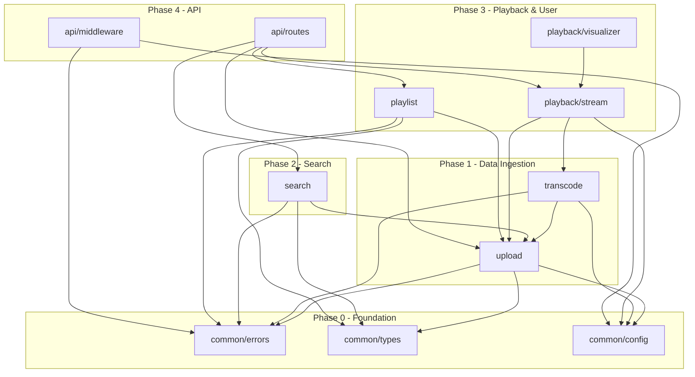
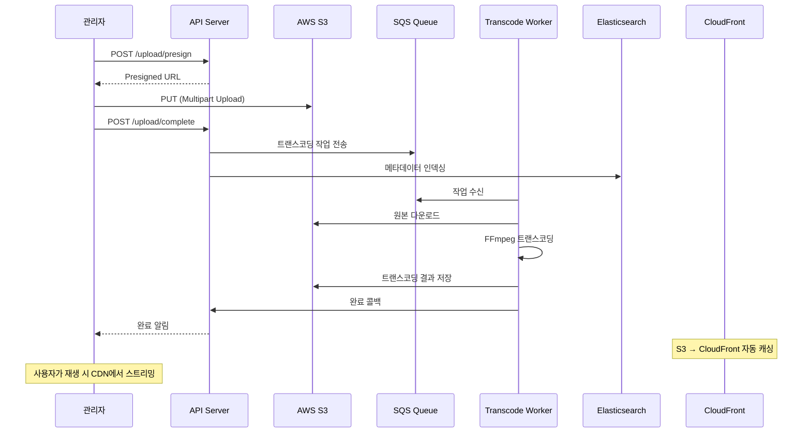
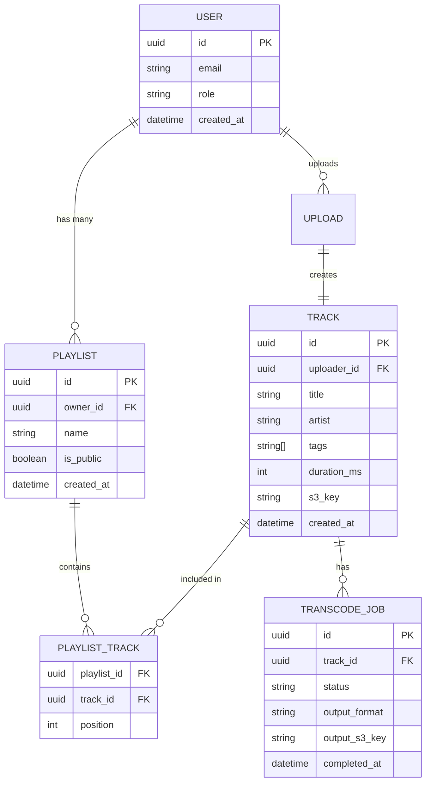
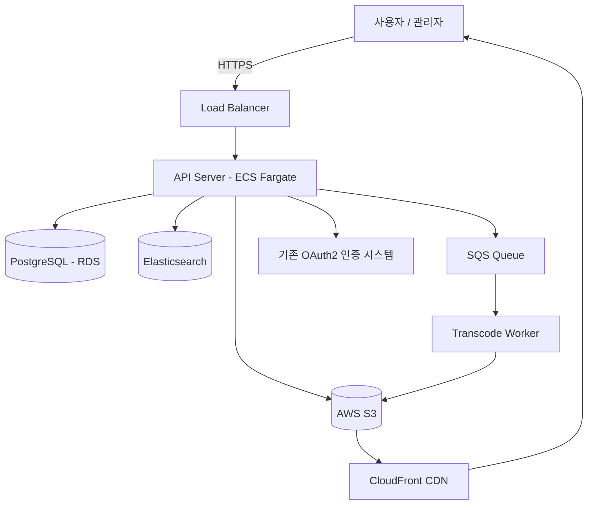

# SoundFlow — Product Requirements Document (PRD)

> **문서 버전**: v1.0  
> **작성일**: 2025-02-12  
> **작성자**: 김개발 / Platform 팀  
> **상태**: In Review  
> **최종 승인자**: 이PM / Product Manager

---

## 변경 이력 (Changelog)

| 버전 | 날짜 | 작성자 | 변경 내용 |
| ------ | ------ | -------- | ----------- |
| v0.1 | 2025-01-15 | 김개발 | 최초 작성 |
| v0.2 | 2025-01-22 | 김개발 | 비기능 요구사항 및 테스트 전략 추가 |
| v1.0 | 2025-02-12 | 김개발 | 의존성 그래프 보완, 리뷰 요청 |

---

## 1. 배경 및 문제 정의 (Background & Problem Statement)

### 1.1 현재 상태 (Current State)

내부에서 사용하는 오디오 콘텐츠 관리 시스템이 레거시 모놀리식 아키텍처로 운영 중이며, 다수의 운영 문제가 발생하고 있다.

- 월간 장애 건수: 평균 45건 (최근 6개월)
- 파일 업로드 실패율: 12% (대용량 파일 기준)
- 평균 검색 응답 시간: 4.2초 (사용자 불만 상위 3위)
- 동시 재생 가능 사용자: 최대 200명

### 1.2 문제 정의 (Problem Statement)

- **핵심 문제**: 레거시 모놀리식 아키텍처로 인해 기능 확장과 안정적 운영이 어려움
- **영향 범위**: 전체 콘텐츠 팀 (50명), 외부 파트너 (20개 사), 최종 사용자 (약 10만 명)
- **긴급도 근거**: 6개월 이내 동시 사용자 수가 2배로 증가할 것으로 예상되며, 현재 아키텍처로는 수용 불가

### 1.3 현재 상태의 한계 (Limitations)

- 모놀리식 구조로 인해 특정 모듈의 배포가 전체 시스템에 영향
- 오디오 트랜스코딩이 동기 처리되어 대용량 파일 업로드 시 타임아웃 빈발
- 검색 인덱스가 RDBMS에 종속되어 전문 검색 성능 부족
- 수평 확장이 불가능한 세션 기반 아키텍처

---

## 2. 목표 및 비목표 (Goals & Non-Goals)

### 2.1 목표 (Goals)

| ID    | 목표         | 성공 기준               | 측정 방법            |
| ----- | ---------- | ------------------- | ---------------- |
| G-001 | 시스템 안정성 향상 | 월간 장애 ≤ 5건          | PagerDuty 장애 리포트 |
| G-002 | 업로드 성공률 개선 | 업로드 성공률 ≥ 99.5%     | 업로드 성공/실패 메트릭    |
| G-003 | 검색 성능 개선   | 검색 응답시간 P95 ≤ 300ms | APM 모니터링         |
| G-004 | 동시 사용자 확장  | 동시 재생 ≥ 2,000명      | 부하 테스트           |

### 2.2 비목표 (Non-Goals)

| ID | 비목표 | 근거 |
| ---- | -------- | ------ |
| NG-001 | 모바일 앱 개발 | 모바일은 다음 분기(Q3)에 별도 PRD로 진행 |
| NG-002 | AI 기반 음악 추천 | 현재 단계에서는 기본 검색/필터링 기능에 집중 |
| NG-003 | 결제 시스템 통합 | 기존 결제 시스템을 그대로 유지, 통합은 Phase 2 이후 |

---

## 3. 범위 및 가정 (Scope & Assumptions)

### 3.1 포함 범위 (In Scope)

- 오디오 파일 업로드/관리 (메타데이터 포함)
- 오디오 스트리밍 재생 엔진
- 전문 검색 기능 (제목, 아티스트, 태그)
- 재생목록(Playlist) CRUD
- 실시간 주파수 시각화 (Web Audio API)

### 3.2 제외 범위 (Out of Scope)

- 비디오 콘텐츠 지원 (이번 버전은 오디오 전용)
- 소셜 기능 (댓글, 좋아요, 공유)
- 오프라인 재생

### 3.3 전제 조건 (Assumptions)

| ID | 가정 | 검증 방법 | 검증 시점 |
| ---- | ------ | ----------- | ----------- |
| A-001 | AWS S3를 오디오 스토리지로 사용 가능 | 인프라 팀 확인 | Phase 0 시작 전 |
| A-002 | Elasticsearch 클러스터 프로비저닝 가능 | DevOps 팀 확인 | Phase 1 시작 전 |
| A-003 | 기존 사용자 데이터 마이그레이션 가능 | 데이터 팀 POC | Phase 0 |

### 3.4 제약 조건 (Constraints)

- **기술적 제약**: Node.js(TypeScript) + React 기반, 기존 인증 시스템(OAuth2) 연동 필수
- **비즈니스 제약**: 예산 AWS 월 $5,000 이내, 12주 일정
- **운영 제약**: 무중단 배포 필수, 기존 서비스와의 역호환 유지

---

## 4. 사용자 및 사용 시나리오 (Users & Scenarios)

### 4.1 행위 주체 정의 (Actors)

| 행위 주체 | 역할 | 설명 |
| ----------- | ------ | ------ |
| 일반 사용자 | 리스너 | 오디오 콘텐츠를 검색, 재생, 재생목록 관리 |
| 콘텐츠 관리자 | 업로더 | 오디오 파일 업로드, 메타데이터 관리 |
| 시스템 관리자 | 운영자 | 시스템 모니터링, 사용자 관리, 설정 변경 |
| 외부 시스템 | 연동 | 기존 결제/인증 시스템과의 API 연동 |

### 4.2 핵심 사용 시나리오 (Key Scenarios)

#### 시나리오 1: 대용량 오디오 파일 업로드

- **행위 주체**: 콘텐츠 관리자
- **사전 조건**: 인증 완료, 업로드 권한 보유
- **흐름**:
  1. 관리자가 오디오 파일(최대 500MB)을 선택
  2. 시스템이 Presigned URL을 발급하여 S3에 직접 업로드
  3. 업로드 진행률 실시간 표시
  4. 업로드 완료 후 트랜스코딩 작업이 비동기로 시작
  5. 트랜스코딩 완료 시 관리자에게 알림
- **사후 조건**: 원본 + 트랜스코딩 파일 저장, 메타데이터 DB 기록
- **예외 흐름**: 네트워크 오류 시 Resumable Upload 지원, 3회 자동 재시도

#### 시나리오 2: 오디오 검색 및 재생

- **행위 주체**: 일반 사용자
- **사전 조건**: 인증 완료
- **흐름**:
  1. 사용자가 검색어 입력 (자동완성 지원)
  2. Elasticsearch에서 제목/아티스트/태그 기반 전문 검색
  3. 검색 결과 표시 (페이지네이션, 정렬)
  4. 사용자가 트랙 선택 시 스트리밍 재생 시작
  5. Web Audio API 기반 실시간 주파수 시각화
- **사후 조건**: 재생 기록 저장, 재생 카운트 증가
- **예외 흐름**: 스트리밍 실패 시 CDN 폴백, 버퍼링 상태 UI 표시

---

## 5. 기능 요구사항 — Functional Decomposition (WHAT)

### Capability 1: 오디오 파일 관리 (Audio Management)

#### REQ-001: 대용량 파일 업로드

| 항목 | 내용 |
| ------ | ------ |
| **ID** | REQ-001 |
| **우선순위** | Must |
| **설명** | 최대 500MB 오디오 파일의 Resumable Upload을 지원 |
| **입력** | 오디오 파일 (WAV, MP3, FLAC, AAC), 메타데이터 (제목, 아티스트, 태그) |
| **출력** | 업로드 상태 (진행률, 완료, 실패), 파일 ID |
| **동작** | Presigned URL 발급 → S3 Multipart Upload → 메타데이터 저장 → 트랜스코딩 큐 전송 |
| **의존성** | 없음 (Phase 0) |

**수락 기준:**

- [ ] [AC-001] 500MB 파일이 60초 이내에 업로드 완료
- [ ] [AC-002] 업로드 진행률이 1% 단위로 실시간 표시
- [ ] [AC-003] 네트워크 중단 후 재연결 시 이어서 업로드
- [ ] [AC-004] 지원하지 않는 포맷 업로드 시 명확한 에러 메시지 반환

**엣지 케이스:**

- 동시 업로드 5건 초과 시: 큐잉 처리, 사용자에게 대기 순서 표시
- 디스크 용량 부족 시: 관리자 알림 + 사용자에게 일시적 불가 안내

#### REQ-002: 오디오 트랜스코딩

| 항목 | 내용 |
| ------ | ------ |
| **ID** | REQ-002 |
| **우선순위** | Must |
| **설명** | 업로드된 오디오를 스트리밍용 포맷(128kbps MP3, 256kbps AAC)으로 비동기 변환 |
| **입력** | 원본 오디오 파일 (S3 Key) |
| **출력** | 트랜스코딩된 파일 (다중 비트레이트), 상태 알림 |
| **동작** | SQS → Worker → FFmpeg 트랜스코딩 → S3 저장 → DB 업데이트 → 알림 발송 |
| **의존성** | REQ-001 |

**수락 기준:**

- [ ] [AC-001] 10분 길이 WAV 파일이 30초 이내에 트랜스코딩 완료
- [ ] [AC-002] 트랜스코딩 실패 시 3회 자동 재시도 후 관리자 알림
- [ ] [AC-003] 다중 비트레이트 파일이 올바르게 생성되고 재생 가능

### Capability 2: 검색 (Search)

#### REQ-003: 전문 검색

| 항목 | 내용 |
| ------ | ------ |
| **ID** | REQ-003 |
| **우선순위** | Must |
| **설명** | Elasticsearch 기반 오디오 콘텐츠 전문 검색 (제목, 아티스트, 태그, 설명) |
| **입력** | 검색 쿼리, 필터 (장르, 날짜, 형식), 정렬 옵션, 페이지네이션 |
| **출력** | 검색 결과 목록 (하이라이팅 포함), 총 건수, 패싯(Facet) |
| **동작** | 검색 쿼리 파싱 → Elasticsearch Multi-match → 결과 랭킹 → 응답 |
| **의존성** | REQ-001 (인덱싱할 데이터 필요) |

**수락 기준:**

- [ ] [AC-001] 검색 응답 P95 ≤ 300ms
- [ ] [AC-002] 한글 형태소 분석 기반 정확한 검색 결과
- [ ] [AC-003] 자동완성 200ms 이내 응답
- [ ] [AC-004] 빈 결과 시 유사 검색어 제안

### Capability 3: 스트리밍 재생 (Playback)

#### REQ-004: 적응형 스트리밍 재생

| 항목 | 내용 |
| ------ | ------ |
| **ID** | REQ-004 |
| **우선순위** | Must |
| **설명** | 네트워크 상태에 따라 비트레이트를 자동 조절하는 적응형 스트리밍 |
| **입력** | 트랙 ID, 사용자 네트워크 상태 |
| **출력** | 오디오 스트림, 재생 메타데이터 |
| **동작** | CDN URL 생성 → HLS/DASH 스트리밍 → 비트레이트 자동 전환 |
| **의존성** | REQ-002 (트랜스코딩 완료 필요) |

**수락 기준:**

- [ ] [AC-001] 재생 시작까지 2초 이내 (Cold Start)
- [ ] [AC-002] 동시 2,000명 재생 시 끊김 없음
- [ ] [AC-003] 네트워크 대역폭 변화 시 5초 이내 비트레이트 전환

#### REQ-005: 실시간 주파수 시각화

| 항목 | 내용 |
| ------ | ------ |
| **ID** | REQ-005 |
| **우선순위** | Should |
| **설명** | Web Audio API를 사용한 오디오 주파수 스펙트럼 실시간 렌더링 |
| **입력** | 오디오 스트림 데이터 |
| **출력** | Canvas/WebGL 기반 시각화 UI |
| **동작** | AudioContext → AnalyserNode → FFT → Canvas 렌더링 (60fps) |
| **의존성** | REQ-004 |

**수락 기준:**

- [ ] [AC-001] 60fps로 부드러운 시각화 렌더링
- [ ] [AC-002] 재생 중 CPU 사용률 15% 이하 (데스크톱 기준)

### Capability 4: 재생목록 관리 (Playlist)

#### REQ-006: 재생목록 CRUD

| 항목 | 내용 |
| ------ | ------ |
| **ID** | REQ-006 |
| **우선순위** | Must |
| **설명** | 사용자 재생목록 생성, 조회, 수정, 삭제 |
| **입력** | 재생목록명, 트랙 목록, 공개/비공개 설정 |
| **출력** | 재생목록 상세 정보 |
| **동작** | CRUD API → PostgreSQL 저장 → 캐시 무효화 |
| **의존성** | REQ-001 (트랙 데이터 필요) |

**수락 기준:**

- [ ] [AC-001] 재생목록 최대 1,000곡 지원
- [ ] [AC-002] 드래그 앤 드롭 순서 변경
- [ ] [AC-003] 공개 재생목록 URL 공유 가능

---

## 6. 비기능 요구사항 (Non-Functional Requirements)

### 6.1 성능 (Performance)

| ID | 요구사항 | 목표값 | 측정 방법 |
| ---- | ---------- | -------- | ----------- |
| NFR-P001 | API 응답 시간 (P95) | ≤ 200ms | DataDog APM |
| NFR-P002 | 동시 스트리밍 사용자 | ≥ 2,000명 | k6 부하 테스트 |
| NFR-P003 | 검색 응답 시간 (P95) | ≤ 300ms | Elasticsearch 모니터링 |
| NFR-P004 | 파일 업로드 처리량 | ≥ 100 req/min | CloudWatch 메트릭 |

### 6.2 신뢰성 (Reliability)

| ID | 요구사항 | 목표값 |
| ---- | ---------- | -------- |
| NFR-R001 | 가용성 | 99.9% (연간 다운타임 ≤ 8.76h) |
| NFR-R002 | MTTR | ≤ 30분 |
| NFR-R003 | 데이터 내구성 | 99.999999999% (S3 기본) |

### 6.3 확장성 (Scalability)

- **수평 확장**: ECS Fargate 기반 오토 스케일링 (CPU 70% 기준), 최소 2 → 최대 10 인스턴스
- **수직 확장**: RDS r6g.xlarge → r6g.2xlarge 업그레이드 가능 (예상 1년 이내)
- **데이터 증가율 대응**: 월 500GB 오디오 파일 증가 예상, S3 Intelligent-Tiering으로 비용 최적화

### 6.4 보안 (Security)

| ID | 요구사항 | 상세 |
| ---- | ---------- | ------ |
| NFR-S001 | 인증 | 기존 OAuth2 시스템 연동, JWT 액세스 토큰 |
| NFR-S002 | 인가 | RBAC (Admin, Uploader, Listener) |
| NFR-S003 | 전송 암호화 | TLS 1.3 |
| NFR-S004 | API 보안 | Rate limiting (100 req/min/user), Input validation |

### 6.4 관측성 (Observability)

- **로그**: 구조화된 JSON 로그, CloudWatch Logs, 보존 90일
- **메트릭**: 업로드/재생/검색 성공률, 응답 시간, 에러율
- **트레이스**: OpenTelemetry 기반 분산 트레이싱
- **알람**: 에러율 > 1%, P95 > 500ms, 디스크 사용률 > 80%

---

## 7. 구조 분해 — Structural Decomposition (HOW)

### 7.1 프로젝트 구조

```
soundflow/
├── src/
│   ├── common/              # 공통 모듈 (Phase 0)
│   │   ├── errors/          (REQ 전체: 에러 처리)
│   │   ├── types/           (REQ 전체: 타입 정의)
│   │   └── config/          (REQ 전체: 설정 관리)
│   ├── upload/              # 업로드 모듈 (Phase 1)
│   │   ├── upload.service.ts    (REQ-001)
│   │   ├── transcode.worker.ts  (REQ-002)
│   │   └── index.ts
│   ├── search/              # 검색 모듈 (Phase 2)
│   │   ├── search.service.ts    (REQ-003)
│   │   ├── indexer.ts           (REQ-003)
│   │   └── index.ts
│   ├── playback/            # 재생 모듈 (Phase 3)
│   │   ├── stream.service.ts    (REQ-004)
│   │   ├── visualizer.ts        (REQ-005)
│   │   └── index.ts
│   ├── playlist/            # 재생목록 모듈 (Phase 3)
│   │   ├── playlist.service.ts  (REQ-006)
│   │   └── index.ts
│   └── api/                 # API 라우터 (Phase 4)
│       ├── routes/
│       ├── middleware/
│       └── index.ts
├── tests/
│   ├── unit/
│   ├── integration/
│   └── e2e/
├── infrastructure/
│   ├── terraform/
│   └── docker/
└── docs/
```

### 7.2 모듈-기능 매핑

| 모듈 | Capability | 포함 기능 | Public Interface |
| ------ | ----------- | ----------- | ------------------ |
| common | 공통 | 에러, 타입, 설정 | AppError, BaseConfig, types |
| upload | Audio Management | REQ-001, REQ-002 | uploadFile(), getUploadStatus() |
| search | Search | REQ-003 | search(), suggest(), reindex() |
| playback | Playback | REQ-004, REQ-005 | getStreamUrl(), getVisualizerData() |
| playlist | Playlist | REQ-006 | createPlaylist(), updatePlaylist() |
| api | API Gateway | 전체 라우팅 | REST endpoints |

---

## 8. 의존성 그래프 — Dependency Graph (CRITICAL)

### Phase 0 — Foundation (의존성 없음)

| 모듈 | 설명 | 의존성 |
| ------ | ------ | -------- |
| common/errors | 커스텀 에러 클래스, 에러 핸들링 미들웨어 | 없음 |
| common/types | 공통 인터페이스, DTO 정의 | 없음 |
| common/config | 환경 설정 관리 (dotenv + validation) | 없음 |

### Phase 1 — Data Ingestion

| 모듈 | 설명 | 의존성 |
| ------ | ------ | -------- |
| upload | S3 업로드, 메타데이터 저장 | Depends on: [common/errors, common/types, common/config] |
| transcode | 비동기 트랜스코딩 워커 | Depends on: [upload, common/errors, common/config] |

### Phase 2 — Search & Discovery

| 모듈 | 설명 | 의존성 |
| ------ | ------ | -------- |
| search | Elasticsearch 검색 서비스 | Depends on: [common/types, common/errors, upload] |

### Phase 3 — Playback & User Features

| 모듈 | 설명 | 의존성 |
| ------ | ------ | -------- |
| playback/stream | CDN 기반 스트리밍 서비스 | Depends on: [upload, transcode, common/config] |
| playback/visualizer | Web Audio API 시각화 | Depends on: [playback/stream] |
| playlist | 재생목록 CRUD | Depends on: [upload, common/types, common/errors] |

### Phase 4 — API Integration

| 모듈 | 설명 | 의존성 |
| ------ | ------ | -------- |
| api/routes | REST API 라우터 | Depends on: [upload, search, playback, playlist] |
| api/middleware | 인증, Rate Limit, 에러 핸들링 | Depends on: [common/errors, common/config] |

### 의존성 시각화



---

## 9. API 명세 초안

### 9.1 엔드포인트 목록

| 메서드 | 경로 | 설명 | 인증 | 관련 REQ |
| -------- | ------ | ------ | ------ | ---------- |
| POST | /api/v1/upload/presign | Presigned URL 발급 | Yes (Uploader+) | REQ-001 |
| POST | /api/v1/upload/complete | 업로드 완료 알림 | Yes (Uploader+) | REQ-001 |
| GET | /api/v1/upload/:id/status | 트랜스코딩 상태 조회 | Yes | REQ-002 |
| GET | /api/v1/search | 오디오 검색 | Yes | REQ-003 |
| GET | /api/v1/search/suggest | 자동완성 | Yes | REQ-003 |
| GET | /api/v1/tracks/:id/stream | 스트리밍 URL 발급 | Yes | REQ-004 |
| POST | /api/v1/playlists | 재생목록 생성 | Yes | REQ-006 |
| GET | /api/v1/playlists/:id | 재생목록 상세 | Yes | REQ-006 |
| PUT | /api/v1/playlists/:id | 재생목록 수정 | Yes (Owner) | REQ-006 |
| DELETE | /api/v1/playlists/:id | 재생목록 삭제 | Yes (Owner) | REQ-006 |

### 9.2 에러 모델

```json
{
  "error": {
    "code": "UPLOAD_FILE_TOO_LARGE",
    "message": "파일 크기가 500MB를 초과합니다.",
    "details": {
      "maxSize": "500MB",
      "actualSize": "612MB"
    },
    "requestId": "req_abc123"
  }
}
```

---

## 10. 데이터 흐름

### 10.1 오디오 업로드 → 재생 플로우



### 10.2 데이터 모델



---

## 11. 리스크 및 오픈 이슈

### 11.1 리스크 매트릭스

| ID | 리스크 | 확률 | 영향도 | 완화 전략 | 담당 |
|----|--------|------|--------|-----------|------|
| RISK-001 | 대용량 파일 트랜스코딩 병목 | 중간 | 높음 | Auto Scaling Worker + Dead Letter Queue | 백엔드 팀 |
| RISK-002 | Elasticsearch 클러스터 장애 | 낮음 | 높음 | 멀티 AZ 구성 + DB 검색 폴백 | DevOps 팀 |
| RISK-003 | CDN 비용 초과 | 중간 | 중간 | 캐시 최적화 + 비트레이트 자동 조절 | 인프라 팀 |

### 11.2 오픈 이슈

| ID | 이슈 | 결정 시한 | 의사결정자 | 상태 |
| ---- | ------ | ----------- | ------------ | ------ |
| ISSUE-001 | HLS vs DASH 스트리밍 프로토콜 선택 | 2025-02-20 | CTO | Open |
| ISSUE-002 | Elasticsearch vs OpenSearch 선택 | 2025-02-15 | 아키텍트 | Open |

### 11.3 기술 결정 사항

| 결정 사항 | 선택 | 대안 | 선택 근거 |
| ----------- | ------ | ------ | ----------- |
| 언어 | TypeScript | Go, Rust | 팀 역량, 프론트엔드 코드 공유 |
| 런타임 | Node.js 20 LTS | Deno, Bun | 생태계 성숙도, AWS Lambda 지원 |
| DB | PostgreSQL 16 | MySQL, MongoDB | ACID, JSON 지원, 확장성 |
| 검색 | Elasticsearch 8.x | OpenSearch, Algolia | 한글 형태소 분석, 자체 호스팅 가능 |
| 큐 | AWS SQS | RabbitMQ, Kafka | 관리 부담 최소화, AWS 네이티브 |

---

## 12. 구현 로드맵

### Phase 0: Foundation — 1주

- **진입 조건**: PRD 승인 완료, 인프라 프로비저닝 확인
- **산출물**: common/errors, common/types, common/config, CI/CD 파이프라인
- **종료 조건**: 공통 모듈 단위 테스트 100% 통과, 개발 환경 구동 확인

### Phase 1: Data Ingestion — 2주

- **진입 조건**: Phase 0 완료, S3/SQS 프로비저닝 완료
- **산출물**: upload 모듈, transcode 워커
- **종료 조건**: 500MB 파일 업로드 + 트랜스코딩 E2E 테스트 통과

### Phase 2: Search — 2주

- **진입 조건**: Phase 1 완료, Elasticsearch 클러스터 준비
- **산출물**: search 모듈, 인덱서
- **종료 조건**: 검색 P95 ≤ 300ms, 한글 형태소 분석 정확도 검증

### Phase 3: Playback & User Features — 3주

- **진입 조건**: Phase 2 완료
- **산출물**: playback 모듈, visualizer, playlist 모듈
- **종료 조건**: 동시 2,000명 스트리밍 부하 테스트 통과

### Phase 4: API Integration & Polish — 2주

- **진입 조건**: Phase 3 완료
- **산출물**: API 라우터, 미들웨어, 프론트엔드 통합
- **종료 조건**: 전체 E2E 테스트 통과, 성능 목표 달성, 보안 감사 완료

---

## 13. 롤아웃

### 13.1 배포 전략

- **배포 방식**: Blue-Green + Feature Flag (LaunchDarkly)
- **단계별 계획**:
  1. 내부 테스트 (스테이징) — 1주
  2. 카나리 배포 5% — 3일
  3. 카나리 확대 25% → 50% → 100% — 1주

### 13.2 역호환성

- 기존 API v0 엔드포인트는 6개월간 유지 (Deprecation Warning 헤더)
- 기존 업로드 파일은 자동 마이그레이션 (백그라운드 배치)

---

## 14. 테스트 및 검증 계획

### 14.1 테스트 피라미드

| 유형 | 비율 | 프레임워크 | 실행 환경 |
| ------ | ------ | ----------- | ----------- |
| Unit | 70% | Vitest | CI (GitHub Actions) |
| Integration | 20% | Supertest + Testcontainers | CI |
| E2E | 10% | Playwright | 스테이징 |

### 14.2 커버리지 요구사항

- 전체: ≥ 80%
- Critical Path (업로드, 검색, 재생): ≥ 95%

### 14.3 모듈별 핵심 테스트 시나리오

| 모듈 | 테스트 시나리오 | 유형 |
| ------ | ---------------- | ------ |
| upload | 정상 업로드, 대용량, 중단 후 재개, 잘못된 포맷 | Unit + Integration |
| transcode | 정상 변환, 실패 재시도, DLQ 이동, 동시 처리 | Unit + Integration |
| search | 한글 검색, 자동완성, 빈 결과, 패싯 필터링 | Unit + Integration |
| playback | 스트리밍 시작, 비트레이트 전환, CDN 폴백 | Integration + E2E |
| playlist | CRUD, 순서 변경, 공개/비공개 전환, 1000곡 한계 | Unit |

### 14.4 성능 테스트

- k6로 동시 2,000명 스트리밍 부하 테스트
- Artillery로 API 응답 시간 벤치마크
- 30분 소크 테스트로 메모리 누수 검증

---

## 15. 아키텍처 개요 (Architecture Overview)

### 15.1 시스템 컨텍스트 (C4 Level 1)



### 15.2 트레이드오프 (Trade-offs)

| 결정                      | 이점                                 | 비용/제약                    | 수용 근거                                      |
| ------------------------- | ------------------------------------ | ---------------------------- | ---------------------------------------------- |
| SQS 비동기 트랜스코딩     | 업로드 응답 즉시 반환, 확장 용이     | 트랜스코딩 완료까지 지연     | 사용자 경험 > 즉시 재생 (알림으로 보완)        |
| Elasticsearch 별도 클러스터 | 전문 검색 성능, RDBMS 부하 분산      | 인프라 비용 증가, 동기화 필요 | 검색 P95 300ms 목표 달성 불가 시 대안 없음     |
| S3 + CloudFront 스트리밍  | 글로벌 배포 용이, 고가용성           | CDN 비용                     | 자체 스트리밍 서버 대비 운영 부담 대폭 감소    |

---

## 부록

### A. 용어 정의

| 용어 | 정의 |
| ------ | ------ |
| Presigned URL | S3에 직접 업로드할 수 있도록 미리 서명된 임시 URL |
| Resumable Upload | 중단 후 이어서 업로드할 수 있는 방식 |
| 트랜스코딩 | 오디오 파일을 다른 포맷/비트레이트로 변환 |
| 패싯(Facet) | 검색 결과를 카테고리별로 분류하여 보여주는 필터 |
| DLQ | Dead Letter Queue, 처리 실패한 메시지를 격리하는 큐 |

### B. 참고 자료

- [AWS S3 Multipart Upload](https://docs.aws.amazon.com/AmazonS3/latest/userguide/mpuoverview.html)
- [Elasticsearch Korean Analyzer](https://www.elastic.co/guide/en/elasticsearch/plugins/current/analysis-nori.html)
- [Web Audio API MDN](https://developer.mozilla.org/en-US/docs/Web/API/Web_Audio_API)

### C. 이해관계자 승인 (Stakeholder Sign-off)

| 역할            | 이름     | 승인 날짜  | 상태    |
| --------------- | -------- | ---------- | ------- |
| Product Manager | 이PM     | 2025-02-15 | Pending |
| Tech Lead       | 박리드   | 2025-02-15 | Pending |
| Design Lead     | 최디자인 | 2025-02-15 | Pending |
| DevOps Lead     | 정인프라 | 2025-02-15 | Pending |
