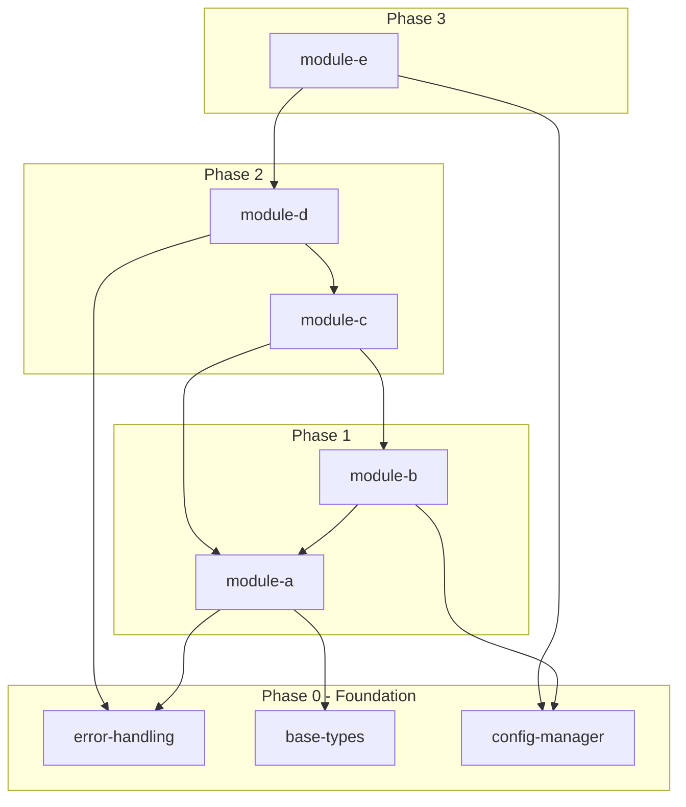
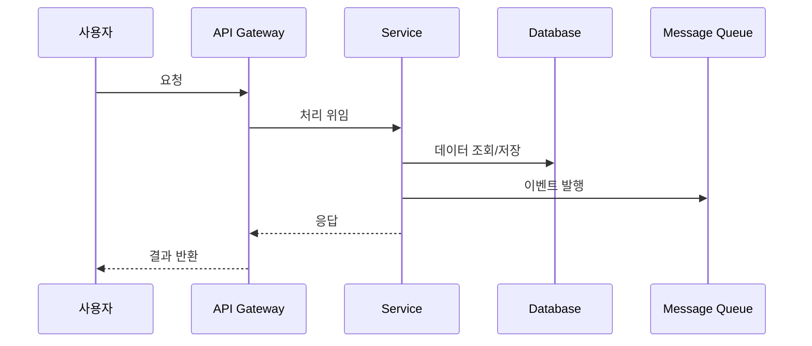
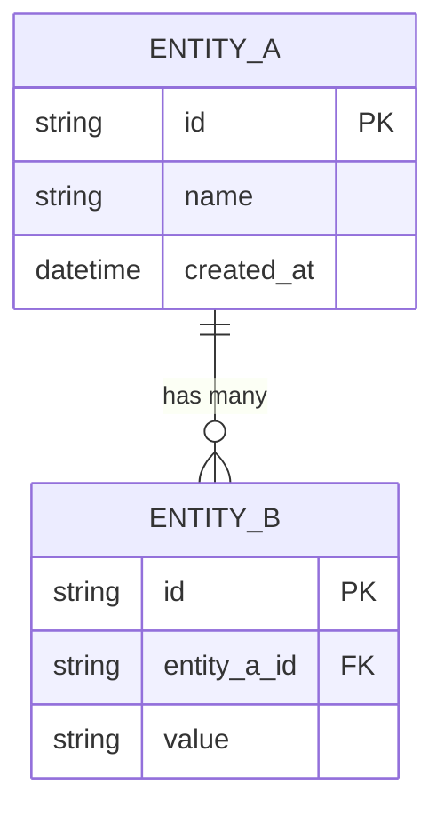
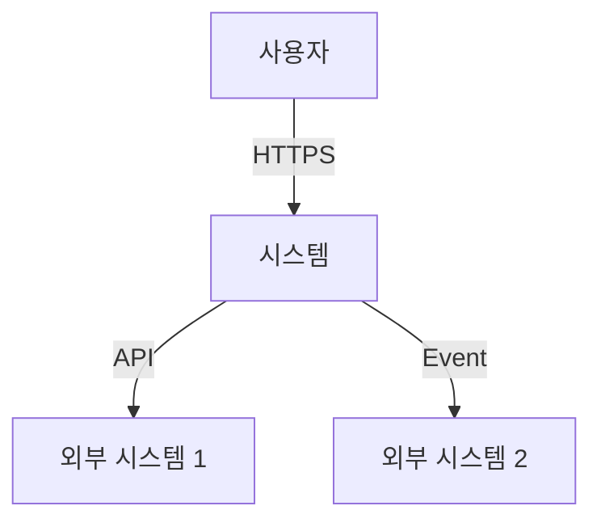
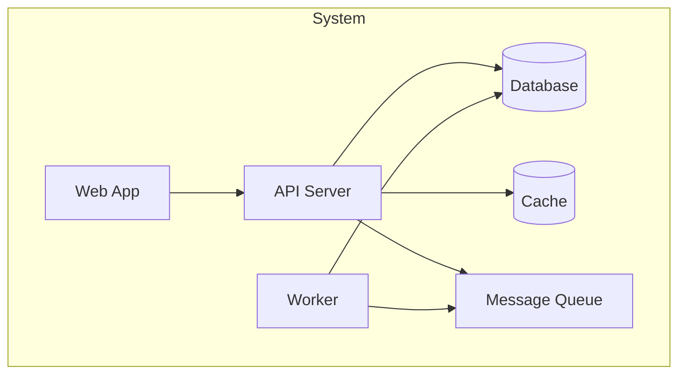

# [프로젝트명] — Product Requirements Document (PRD)

> **문서 버전**: v0.1  
> **작성일**: YYYY-MM-DD  
> **작성자**: [이름 / 팀명]  
> **상태**: Draft | In Review | Approved | Archived  
> **최종 승인자**: [이름 / 역할]

---

## 변경 이력 (Changelog)

| 버전 | 날짜       | 작성자 | 변경 내용 |
| ---- | ---------- | ------ | --------- |
| v0.1 | YYYY-MM-DD | [이름] | 최초 작성 |

---

## 1. 배경 및 문제 정의 (Background & Problem Statement)

### 1.1 현재 상태 (Current State)

<!-- 현재 시스템/프로세스의 상태를 기술합니다. -->
<!-- 데이터, 메트릭, 사용자 피드백 등 객관적 근거를 포함하세요. -->

- [현재 상태 설명]
- [관련 데이터/메트릭: 예) 월간 장애 150건, 평균 응답시간 3초]

### 1.2 문제 정의 (Problem Statement)

<!-- 왜 지금 이 문제를 해결해야 하는지 명확히 기술합니다. -->

- **핵심 문제**: [해결하고자 하는 핵심 문제]
- **영향 범위**: [문제가 미치는 영향 — 사용자, 비즈니스, 기술적 측면]
- **긴급도 근거**: [왜 지금 해결해야 하는지]

### 1.3 현재 상태의 한계 (Limitations)

- [한계 1: 기술적 한계]
- [한계 2: 비즈니스적 한계]
- [한계 3: 운영적 한계]

---

## 2. 목표 및 비목표 (Goals & Non-Goals)

### 2.1 목표 (Goals)

| ID    | 목표     | 성공 기준 (Success Criteria) | 측정 방법   |
| ----- | -------- | ---------------------------- | ----------- |
| G-001 | [목표 1] | [정량적 성공 기준]           | [측정 방법] |
| G-002 | [목표 2] | [정량적 성공 기준]           | [측정 방법] |
| G-003 | [목표 3] | [정량적 성공 기준]           | [측정 방법] |

### 2.2 비목표 (Non-Goals)

> 이번 PRD에서 **명시적으로 하지 않는 것**을 정의합니다.  
> 범위 확장(Scope Creep)을 방지하는 데 핵심적인 섹션입니다.

| ID     | 비목표     | 근거   |
| ------ | ---------- | ------ |
| NG-001 | [비목표 1] | [이유] |
| NG-002 | [비목표 2] | [이유] |

---

## 3. 범위 및 가정 (Scope & Assumptions)

### 3.1 포함 범위 (In Scope)

- [포함 항목 1]
- [포함 항목 2]
- [포함 항목 3]

### 3.2 제외 범위 (Out of Scope)

- [제외 항목 1: 이유]
- [제외 항목 2: 이유]

### 3.3 전제 조건 (Assumptions)

<!-- 이 PRD가 유효하기 위해 참이어야 하는 전제 조건들 -->

| ID    | 가정     | 검증 방법   | 검증 시점 |
| ----- | -------- | ----------- | --------- |
| A-001 | [가정 1] | [검증 방법] | [시점]    |
| A-002 | [가정 2] | [검증 방법] | [시점]    |

### 3.4 제약 조건 (Constraints)

- **기술적 제약**: [예: 기존 시스템과의 호환성, 특정 언어/프레임워크 사용]
- **비즈니스 제약**: [예: 예산, 일정, 규제]
- **운영 제약**: [예: 배포 윈도우, 인프라 제한]

---

## 4. 사용자 및 사용 시나리오 (Users & Scenarios)

### 4.1 행위 주체 정의 (Actors)

| 행위 주체   | 역할   | 설명                 |
| ----------- | ------ | -------------------- |
| 일반 사용자 | [역할] | [설명]               |
| 관리자      | [역할] | [설명]               |
| 시스템      | [역할] | [자동화 프로세스 등] |
| 외부 시스템 | [역할] | [연동 시스템]        |

### 4.2 핵심 사용 시나리오 (Key Scenarios)

#### 시나리오 1: [시나리오명]

- **행위 주체**: [사용자/관리자/시스템]
- **사전 조건**: [시나리오 시작 전 충족되어야 하는 조건]
- **흐름**:
  1. [단계 1]
  2. [단계 2]
  3. [단계 3]
- **사후 조건**: [시나리오 완료 후 상태]
- **예외 흐름**: [비정상 경로]

#### 시나리오 2: [시나리오명]

- **행위 주체**: [사용자/관리자/시스템]
- **사전 조건**: [조건]
- **흐름**:
  1. [단계 1]
  2. [단계 2]
- **사후 조건**: [완료 후 상태]
- **예외 흐름**: [비정상 경로]

---

## 5. 기능 요구사항 — Functional Decomposition (WHAT)

> 우선순위는 **MoSCoW** 방식을 사용합니다:
>
> - **Must**: 반드시 구현 (없으면 릴리즈 불가)
> - **Should**: 강력히 권장 (일정 내 최대한 포함)
> - **Could**: 있으면 좋음 (여력이 될 때)
> - **Won't**: 이번에는 하지 않음 (명시적 제외)
>
> 각 요구사항에는 고유 ID를 부여하고, 입출력과 동작을 명확히 기술합니다.
> 수락 기준은 검증 가능한 형태로 작성하여 QA와 개발의 완료 기준으로 활용합니다.

### Capability 1: [기능 도메인명]

#### REQ-001: [기능명]

| 항목               | 내용                    |
| ------------------ | ----------------------- |
| **ID**             | REQ-001                 |
| **우선순위**       | Must / Should / Could   |
| **설명**           | [기능에 대한 상세 설명] |
| **입력(Inputs)**   | [입력값 / 데이터]       |
| **출력(Outputs)**  | [출력값 / 결과]         |
| **동작(Behavior)** | [구체적 동작 방식]      |
| **의존성**         | [선행 요구사항 ID]      |
| **담당**           | [팀명/담당자] _(선택)_  |

**수락 기준 (Acceptance Criteria):**

- [ ] [AC-001] [검증 가능한 수락 기준 1]
- [ ] [AC-002] [검증 가능한 수락 기준 2]
- [ ] [AC-003] [엣지 케이스 포함 수락 기준]

**엣지 케이스:**

- [엣지 케이스 1: 처리 방식]
- [엣지 케이스 2: 처리 방식]

#### REQ-002: [기능명]

| 항목               | 내용                    |
| ------------------ | ----------------------- |
| **ID**             | REQ-002                 |
| **우선순위**       | Must / Should / Could   |
| **설명**           | [기능에 대한 상세 설명] |
| **입력(Inputs)**   | [입력값]                |
| **출력(Outputs)**  | [출력값]                |
| **동작(Behavior)** | [동작 방식]             |
| **의존성**         | [REQ-001]               |
| **담당**           | [팀명/담당자] _(선택)_  |

**수락 기준 (Acceptance Criteria):**

- [ ] [AC-001] [수락 기준 1]
- [ ] [AC-002] [수락 기준 2]

### Capability 2: [기능 도메인명]

#### REQ-003: [기능명]

<!-- 위와 동일한 형식으로 작성 -->

---

## 6. 비기능 요구사항 (Non-Functional Requirements)

### 6.1 성능 (Performance)

| ID       | 요구사항            | 목표값    | 측정 방법    |
| -------- | ------------------- | --------- | ------------ |
| NFR-P001 | API 응답 시간 (P95) | ≤ 200ms   | APM 모니터링 |
| NFR-P002 | 동시 사용자 처리    | ≥ 1,000명 | 부하 테스트  |
| NFR-P003 | 처리량 (Throughput) | ≥ 500 TPS | 벤치마크     |

### 6.2 신뢰성 (Reliability)

| ID       | 요구사항              | 목표값                        |
| -------- | --------------------- | ----------------------------- |
| NFR-R001 | 가용성 (Availability) | 99.9% (연간 다운타임 ≤ 8.76h) |
| NFR-R002 | MTTR (평균 복구 시간) | ≤ 30분                        |
| NFR-R003 | 데이터 내구성         | 99.999%                       |

### 6.3 확장성 (Scalability)

- **수평 확장**: [수평 확장 전략]
- **수직 확장**: [수직 확장 한계]
- **데이터 증가율 대응**: [예상 데이터 증가율 및 대응 전략]

### 6.4 보안 (Security)

| ID       | 요구사항         | 상세                                 |
| -------- | ---------------- | ------------------------------------ |
| NFR-S001 | 인증             | [인증 방식: OAuth2, JWT 등]          |
| NFR-S002 | 인가             | [권한 모델: RBAC, ABAC 등]           |
| NFR-S003 | 데이터 암호화    | [전송 중: TLS 1.3, 저장 시: AES-256] |
| NFR-S004 | 민감 데이터 처리 | [PII 마스킹, 감사 로그 등]           |
| NFR-S005 | API 보안         | [Rate limiting, Input validation 등] |

### 6.5 관측성 (Observability)

- **로그**: [로그 수준, 포맷, 보존 기간]
- **메트릭**: [핵심 메트릭 정의, 수집 주기]
- **트레이스**: [분산 트레이싱 전략]
- **알람**: [알람 조건 및 에스컬레이션 정책]
- **SLO 제안**: [서비스 수준 목표]

### 6.6 운영 요구사항 (Operational)

- **배포 전략**: [Blue-Green, Canary, Rolling 등]
- **롤백 절차**: [롤백 소요 시간, 자동/수동]
- **백업 정책**: [주기, 보존 기간, 복구 테스트]
- **인프라 구성**: [클라우드, 온프레미스, 하이브리드]

---

## 7. 구조 분해 — Structural Decomposition (HOW)

> 기능(WHAT)을 실제 코드 구조(HOW)에 매핑합니다.
> 이 섹션은 기능 요구사항이 실제 코드베이스의 어떤 모듈에 대응되는지 정의하여,
> 팀 간 역할 분담과 병렬 개발의 기반을 제공합니다.
> ⚠️ **핵심 원칙**: 기능(WHAT)과 구조(HOW)를 반드시 분리하여 기술하세요.

### 7.1 프로젝트 구조 (Repository Structure)

```text
project-root/
├── src/
│   ├── [module-a]/           # Capability 1
│   │   ├── [file-1].ts       (REQ-001)
│   │   ├── [file-2].ts       (REQ-002)
│   │   └── index.ts          (Exports)
│   ├── [module-b]/           # Capability 2
│   │   ├── [file-3].ts       (REQ-003)
│   │   └── index.ts
│   └── shared/
│       ├── types.ts           (공통 타입)
│       └── utils.ts           (공통 유틸리티)
├── tests/
│   ├── unit/
│   ├── integration/
│   └── e2e/
├── docs/
└── config/
```

### 7.2 모듈-기능 매핑 (Module-to-Capability Mapping)

| 모듈     | Capability   | 포함 기능 (Features) | Public Interface   |
| -------- | ------------ | -------------------- | ------------------ |
| module-a | Capability 1 | REQ-001, REQ-002     | [주요 export 목록] |
| module-b | Capability 2 | REQ-003, REQ-004     | [주요 export 목록] |
| shared   | 공통         | 공통 타입, 유틸리티  | [주요 export 목록] |

### 7.3 Public Interfaces

<!-- 각 모듈의 외부 인터페이스를 명시합니다. -->

```typescript
// module-a/index.ts
export { functionA } from "./file-1";
export { functionB } from "./file-2";
export type { TypeA, TypeB } from "./types";
```

---

## 8. 의존성 그래프 — Dependency Graph (CRITICAL)

> ⚠️ **가장 중요한 섹션입니다.**
> 모든 모듈 간 의존성을 **명시적으로** 선언하고, Phase별로 그룹핑합니다.
> 암묵적 의존성은 절대 허용하지 않습니다.
> 명시적 의존성 선언은 빌드 순서, 테스트 전략, 팀 배정의 기반이 됩니다.

### Phase 0 — Foundation (의존성 없음)

| 모듈           | 설명               | 의존성 |
| -------------- | ------------------ | ------ |
| error-handling | 에러 처리 유틸리티 | 없음   |
| base-types     | 공통 타입 정의     | 없음   |
| config-manager | 설정 관리          | 없음   |

### Phase 1 — [레이어명]

| 모듈       | 설명   | 의존성                                   |
| ---------- | ------ | ---------------------------------------- |
| [module-a] | [설명] | Depends on: [base-types, error-handling] |
| [module-b] | [설명] | Depends on: [module-a, config-manager]   |

### Phase 2 — [레이어명]

| 모듈       | 설명   | 의존성                                 |
| ---------- | ------ | -------------------------------------- |
| [module-c] | [설명] | Depends on: [module-a, module-b]       |
| [module-d] | [설명] | Depends on: [module-c, error-handling] |

### Phase 3 — [레이어명]

| 모듈       | 설명   | 의존성                                 |
| ---------- | ------ | -------------------------------------- |
| [module-e] | [설명] | Depends on: [module-d, config-manager] |

### 의존성 시각화 (Dependency Visualization)



---

## 9. API 명세 초안 (API Specification Draft) _(권장)_

### 9.1 엔드포인트 목록

| 메서드 | 경로                   | 설명   | 인증 필요 | 요청 본문     | 응답           |
| ------ | ---------------------- | ------ | --------- | ------------- | -------------- |
| GET    | /api/v1/[resource]     | [설명] | Yes       | -             | [응답 스키마]  |
| POST   | /api/v1/[resource]     | [설명] | Yes       | [요청 스키마] | [응답 스키마]  |
| PUT    | /api/v1/[resource]/:id | [설명] | Yes       | [요청 스키마] | [응답 스키마]  |
| DELETE | /api/v1/[resource]/:id | [설명] | Yes       | -             | 204 No Content |

### 9.2 에러 모델

```json
{
  "error": {
    "code": "ERROR_CODE",
    "message": "사용자에게 표시할 메시지",
    "details": {
      "field": "에러가 발생한 필드",
      "reason": "상세 원인"
    },
    "requestId": "추적용 요청 ID"
  }
}
```

### 9.3 API 버저닝 전략

- [버저닝 방식: URL path, Header 등]
- [하위 호환성 정책]
- [Deprecation 절차]

---

## 10. 데이터 흐름 및 이벤트 (Data Flow & Events) _(권장)_

### 10.1 주요 데이터 흐름



### 10.2 이벤트 스키마 _(이벤트 기반 아키텍처인 경우)_

| 이벤트명        | 토픽/큐      | 페이로드 스키마 | 발행 시점 |
| --------------- | ------------ | --------------- | --------- |
| [event.created] | [topic-name] | [스키마 링크]   | [조건]    |
| [event.updated] | [topic-name] | [스키마 링크]   | [조건]    |

### 10.3 데이터 모델

<!-- 핵심 엔터티 및 관계를 정의합니다. -->



---

## 11. 리스크 및 오픈 이슈 (Risks & Open Issues)

### 11.1 리스크 매트릭스

| ID       | 리스크        | 발생 확률      | 영향도         | 완화 전략   | 담당     |
| -------- | ------------- | -------------- | -------------- | ----------- | -------- |
| RISK-001 | [리스크 설명] | 높음/중간/낮음 | 높음/중간/낮음 | [완화 방법] | [담당자] |
| RISK-002 | [리스크 설명] | 높음/중간/낮음 | 높음/중간/낮음 | [완화 방법] | [담당자] |

### 11.2 오픈 이슈 (결정 필요 사항)

| ID        | 이슈                 | 결정 시한  | 의사결정자 | 상태            |
| --------- | -------------------- | ---------- | ---------- | --------------- |
| ISSUE-001 | [결정이 필요한 사항] | YYYY-MM-DD | [담당자]   | Open / Resolved |
| ISSUE-002 | [결정이 필요한 사항] | YYYY-MM-DD | [담당자]   | Open / Resolved |

### 11.3 기술 결정 사항 (Technical Decisions)

| 결정 사항       | 선택   | 대안             | 선택 근거 |
| --------------- | ------ | ---------------- | --------- |
| 프로그래밍 언어 | [선택] | [대안 1, 대안 2] | [근거]    |
| 데이터베이스    | [선택] | [대안 1, 대안 2] | [근거]    |
| 메시지 브로커   | [선택] | [대안 1, 대안 2] | [근거]    |

---

## 12. 구현 로드맵 — Implementation Roadmap

### Phase 0: Foundation — [예상 기간]

- **진입 조건**: [Phase 시작 전 충족 필요 사항]
- **산출물**: [이 Phase에서 완성되는 모듈/기능]
- **종료 조건**: [Phase 완료 기준 — 테스트 통과, 코드 리뷰 등]

### Phase 1: [Phase명] — [예상 기간]

- **진입 조건**: Phase 0 종료 조건 충족
- **산출물**: [모듈/기능 목록]
- **종료 조건**: [완료 기준]

### Phase 2: [Phase명] — [예상 기간]

- **진입 조건**: Phase 1 종료 조건 충족
- **산출물**: [모듈/기능 목록]
- **종료 조건**: [완료 기준]

### 마일스톤 요약

```mermaid
gantt
    title 구현 로드맵
    dateFormat  YYYY-MM-DD
    section Phase 0
    Foundation          :a1, YYYY-MM-DD, 7d
    section Phase 1
    [Phase 1 명]        :a2, after a1, 14d
    section Phase 2
    [Phase 2 명]        :a3, after a2, 14d
    section Phase 3
    [Phase 3 명]        :a4, after a3, 14d
```

---

## 13. 롤아웃 및 마이그레이션 (Rollout & Migration)

### 13.1 배포 전략

- **배포 방식**: [Canary / Blue-Green / Rolling / Feature Flag]
- **단계별 배포 계획**:
  1. [단계 1: 내부 테스트 환경]
  2. [단계 2: 스테이징 환경, 카나리 5%]
  3. [단계 3: 카나리 확대 25% → 50% → 100%]

### 13.2 Feature Flag 전략

| 플래그명    | 대상 기능 | 기본값 | 활성화 조건 |
| ----------- | --------- | ------ | ----------- |
| [flag-name] | [기능]    | OFF    | [조건]      |

### 13.3 역호환성 (Backward Compatibility)

- [역호환 보장 범위]
- [Breaking Change가 있는 경우 마이그레이션 경로]

### 13.4 데이터 마이그레이션

- **마이그레이션 대상**: [데이터 범위]
- **마이그레이션 전략**: [온라인/오프라인, 증분/전체]
- **롤백 계획**: [마이그레이션 실패 시 복구 절차]
- **검증 방법**: [데이터 정합성 확인 방법]

---

## 14. 테스트 및 검증 계획 (Test & Verification Plan)

### 14.1 테스트 피라미드

| 유형                      | 비율 | 프레임워크               | 실행 환경 |
| ------------------------- | ---- | ------------------------ | --------- |
| 단위 테스트 (Unit)        | 70%  | [Jest, Vitest 등]        | CI        |
| 통합 테스트 (Integration) | 20%  | [Supertest 등]           | CI/CD     |
| E2E 테스트                | 10%  | [Playwright, Cypress 등] | 스테이징  |

### 14.2 커버리지 요구사항

- **전체 코드 커버리지**: ≥ 80%
- **Critical Path 커버리지**: ≥ 95%
- **새로 추가된 코드 커버리지**: ≥ 90%

### 14.3 모듈별 핵심 테스트 시나리오

| 모듈        | 테스트 시나리오                               | 유형        |
| ----------- | --------------------------------------------- | ----------- |
| [module-a]  | [정상 입력, 비정상 입력, 경계값, 대량 데이터] | Unit        |
| [module-b]  | [모듈 간 연동, 타임아웃, 재시도]              | Integration |
| [전체 흐름] | [사용자 시나리오 기반 E2E]                    | E2E         |

### 14.4 성능 테스트

- **부하 테스트**: [시나리오, 목표 TPS, 도구]
- **스트레스 테스트**: [한계 상황 시나리오]
- **소크 테스트**: [장기간 안정성 검증]

### 14.5 보안 테스트

- [취약점 스캔: OWASP Top 10]
- [침투 테스트 계획]
- [의존성 보안 감사]

---

## 15. 아키텍처 개요 (Architecture Overview) _(권장)_

### 15.1 시스템 컨텍스트 (C4 Level 1)



### 15.2 컨테이너 다이어그램 (C4 Level 2)



### 15.3 트레이드오프 (Trade-offs)

| 결정     | 이점   | 비용        | 수용 근거 |
| -------- | ------ | ----------- | --------- |
| [결정 1] | [이점] | [비용/제약] | [근거]    |
| [결정 2] | [이점] | [비용/제약] | [근거]    |

---

## 16. 운영 런북 요약 (Operational Runbook Summary) _(권장)_

### 16.1 장애 대응 절차

1. [장애 감지: 알람, 모니터링]
2. [초기 대응: 영향도 평가, 커뮤니케이션]
3. [원인 분석: 로그/메트릭 확인]
4. [복구: 롤백, 핫픽스]
5. [사후 분석: 포스트모템 작성]

### 16.2 롤백 절차

- **자동 롤백 조건**: [에러율 > X%, 응답시간 > Yms 등]
- **수동 롤백 절차**: [절차 설명]
- **예상 소요 시간**: [시간]

### 16.3 핫픽스 프로세스

- [핫픽스 브랜치 전략]
- [긴급 배포 승인 절차]
- [핫픽스 후 정규 브랜치 머지 방법]

---

## 부록 (Appendix)

### A. 용어 정의 (Glossary)

| 용어     | 정의   |
| -------- | ------ |
| [용어 1] | [정의] |
| [용어 2] | [정의] |

### B. 참고 자료 (References)

- [참고 자료 1: 링크 또는 문서명]
- [참고 자료 2: 링크 또는 문서명]

### C. 관련 문서 (Related Documents)

- [설계 문서 링크]
- [API 스펙 문서 링크]
- [운영 가이드 링크]

### D. 이해관계자 승인 (Stakeholder Sign-off)

| 역할             | 이름   | 승인 날짜  | 상태                  |
| ---------------- | ------ | ---------- | --------------------- |
| Product Manager  | [이름] | YYYY-MM-DD | Pending / Approved    |
| Tech Lead        | [이름] | YYYY-MM-DD | Pending / Approved    |
| Design Lead      | [이름] | YYYY-MM-DD | Pending / Approved    |
| QA Lead          | [이름] | YYYY-MM-DD | Pending / Approved    |
| [기타 이해관계자] | [이름] | YYYY-MM-DD | Pending / Approved    |
